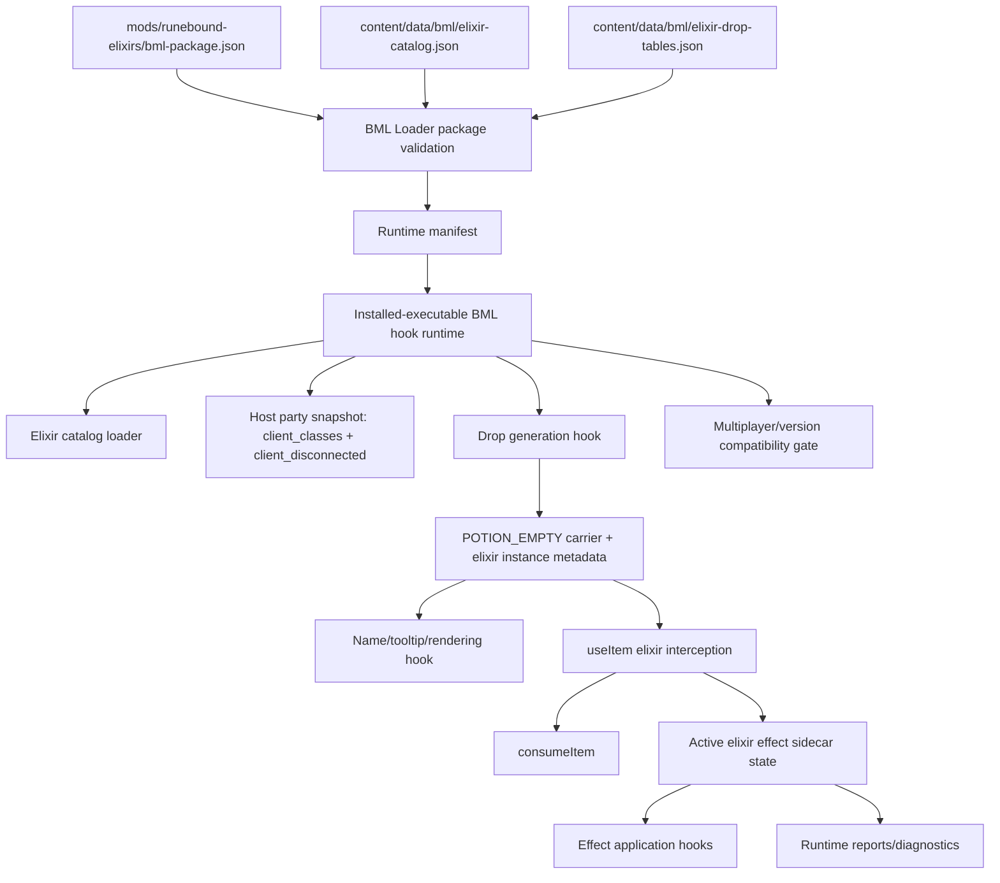

# Runebound: Elixirs Architecture Plan

## Summary

Build **Runebound: Elixirs** as a narrow, authored, host-authoritative BML gameplay module that replaces the current historical broad-item scaffold with **semi-common, class-bound, tradeoff-bearing consumable elixirs**. The first implementation should use a safe Barony-native physical carrier (`POTION_EMPTY`) plus BML sidecar metadata and active-effect state: without a verified BML hook runtime, the item remains vanilla/inert and the package fails closed. This shape directly serves the approved discovery goals—plan-changing drops, meaningful tradeoffs, fast readability, low inventory burden, co-op handoff, stability, and Workshop trust—while avoiding broad affix/relic/ring systems as first scope (`.agents/discovery/2026-07-05-runebound.md:245-258`, `.agents/solutions/2026-07-05-runebound-elixirs-direction-progress.md:254-256`).

---

## Phase 1 — Understand

### Parsed requirements

1. **First feature only:** implement elixirs, not relics/rings/broad affixes/PoE-style uniques. The selected direction is explicitly “Permanent Bargain Elixirs” as first feature (`.agents/solutions/2026-07-05-runebound-elixirs-direction-progress.md:254-256`).
2. **Elixir gameplay:** semi-common consumables/accept-on-use bargains that grant permanent or run-permanent effects with tradeoffs (`.agents/solutions/2026-07-05-runebound-elixirs-direction-progress.md:156-164`, `mods/runebound-elixirs/workshop.toml:3-12`).
3. **Class-bound drop pools:** solo drops match the player’s class; multiplayer drops may include elixirs for all classes currently present (`.agents/solutions/2026-07-05-runebound-elixirs-direction-progress.md:254-256`, `mods/runebound-elixirs/workshop.toml:4-6`).
4. **Party-size eligibility:** some elixirs are eligible only at certain party sizes; default semantics are drop-generation eligibility, not retroactive usability, unless an effect explicitly depends on current allies (`.agents/solutions/2026-07-05-runebound-elixirs-direction-progress.md:236-238`).
5. **Trust boundary:** do not claim playable support without installed-executable hook runtime and live gameplay verification (`mods/runebound-elixirs/bml-package.json:7-8`, `mods/runebound-elixirs/workshop.toml:8-12`).
6. **Codebase grounding:** the implementation has now cut over to package id `jml.runebound-elixirs`, `modules.runeboundElixirs`, elixir-specific capabilities/data files, and evidence-gated installed-hook runtime claims (`mods/runebound-elixirs/bml-package.json`, `mods/runebound-elixirs/workshop.toml`).

### Ambiguities and assumptions

- **A1 — Physical item carrier:** [INFERENCE] Use `POTION_EMPTY` as the first elixir carrier because it is in Barony’s `ItemType` enum (`.tmp/barony-src/src/items.hpp:223-234`), it is categorized as a potion via the item category system (`.tmp/barony-src/src/items.hpp:552-570`, `.tmp/barony-src/src/items.cpp:1133-1140`), and its vanilla use case is inert/hint-only (`.tmp/barony-src/src/items.cpp:3018-3024`). This makes fail-closed behavior safer than adding a new Barony item enum before hook support is proven.
- **A2 — Active elixir state storage:** [INFERENCE] Store consumed elixir effects in BML profile/save sidecar state, not `Stat::attributes`, because Barony player save code explicitly skips player attributes on save and load (`.tmp/barony-src/src/scores.cpp:5739-5771`, `.tmp/barony-src/src/scores.cpp:6519-6560`), even though `Stat` has an `attributes` map (`.tmp/barony-src/src/stat.hpp:456-499`).
- **A3 — Host authority:** [INFERENCE] Drop generation, consumption, and active effect state should be host-authoritative because existing BML architecture assigns gameplay authority to the engine runtime and rejects incompatible multiplayer state (`framework/BaronyModLoader/architecture.md:114-154`), current Runebound affix notes already assume host-side rolls (`mods/runebound-elixirs/content/data/bml/elixir-drop-tables.json:32-36`), and vanilla clients send item-use packets to the host (`.tmp/barony-src/src/items.cpp:2678-2691`).
- **A4 — First effect catalog:** [INFERENCE] Implement a small authored effect catalog with only opcodes backed by verified hook surfaces; do not implement a generic scripting/effect engine because BML package modules are data-only and interpreted by engine-owned code paths (`framework/BaronyModLoader/package-format.md:178-222`).
- **A5 — Visibility:** [INFERENCE] Minimum first-slice visibility should be: clear item name/tooltip before use, explicit consume message, and runtime diagnostics/state reports; a full UI/status panel can be future scope unless required by live testing. The current discovery requires fast recognition and low burden but did not prescribe UI (`.agents/discovery/2026-07-05-runebound.md:119-144`, `.agents/discovery/2026-07-05-runebound.md:18-22`).

---

## Phase 2 — Explore: Grounded Findings

### Approved inputs and product boundary

- The authoritative discovery artifact defines the problem as run identity from drops, meaningful tradeoffs, plan-changing surprise, low burden, stability, co-op compatibility, and Workshop trust (`.agents/discovery/2026-07-05-runebound.md:245-258`).
- The `/architecture` handoff explicitly asks architecture to review Barony item model/modding constraints, prior Runebound scaffold, BML constraints, and stability history (`.agents/discovery/2026-07-05-runebound.md:276-312`).
- The solution artifact records elixirs as selected first feature and records class-bound, present-class multiplayer, and player-count-bound drop eligibility refinements (`.agents/solutions/2026-07-05-runebound-elixirs-direction-progress.md:254-256`).
- The current Workshop copy already describes the elixir direction but clearly states the package is unverified scaffolding and must remain hidden until verified runtime/gameplay evidence exists (`mods/runebound-elixirs/workshop.toml:1-17`).

### Current repo architecture

- Root repo packaging separates Workshop metadata (`workshop.toml`, `preview.png`) from Barony-facing content under `mods/<mod-slug>/content/` (`README.md:5-27`).
- BaronyModLoader has a standalone app plus paired engine hook runtime; the app owns install/profile/package/validation/launch, while engine runtime owns authoritative gameplay hooks and state (`framework/BaronyModLoader/README.md:9-24`).
- BML packages declare content/assets/native/runtime requirements in `bml-package.json`; behavior must come from the manifest, not arbitrary archive files (`framework/BaronyModLoader/package-format.md:25-46`).
- BML packages should use official Barony content systems wherever possible, but content entries do not grant native runtime capabilities (`framework/BaronyModLoader/package-format.md:117-143`).
- Capabilities are the safe vocabulary shared by app, package, and runtime; future packages may declare additional capabilities, but unknown required capabilities must be rejected (`framework/BaronyModLoader/package-format.md:145-176`).
- Native gameplay behavior must be implemented by reviewed BML-owned runtime code, not arbitrary per-mod native plugins (`framework/BaronyModLoader/package-format.md:223-271`).
- Runtime failures should be reported before gameplay when possible and explicit at runtime (`framework/BaronyModLoader/loader-runtime-contract.md:7-15`).
- Activation must fail closed for unknown required capabilities, exclusive binding conflicts, or unverified native runtime requirements (`framework/BaronyModLoader/loader-runtime-contract.md:69-85`).

### Current Runebound elixir implementation reality (status summary)

This section is a review-time status summary of the current repo state, not the original pre-implementation proof ledger. Treat cited package/runtime files and the final verification commands as the source of truth if this summary drifts.

- The Runebound package ID is `jml.runebound-elixirs`, name `Runebound: Elixirs`, and the summary/description describe class-bound permanent bargain elixirs (`mods/runebound-elixirs/bml-package.json:2-8`).
- Its package layout reserves `content/`, `assets/`, `native/`, and `migrations/` roots (`mods/runebound-elixirs/bml-package.json:15-20`).
- Its Barony notes keep the installed-hook trust boundary explicit: stock Barony cannot load the BML-owned data files as standalone behavior, current support is evidence-gated through the paired BML hook runtime, and unsupported builds fail closed (`mods/runebound-elixirs/bml-package.json:21-35`).
- Its declared engine capabilities are elixir-specific: elixir item metadata, host-authoritative drop generation, consumption, active-effect state, active-effect application, item display rendering, and multiplayer version metadata (`mods/runebound-elixirs/bml-package.json:52-92`).
- Its module is `modules.runeboundElixirs`, with `POTION_EMPTY` carrier semantics, class/party-size-aware drop policy, BML sidecar active-effect state, display metadata, multiplayer compatibility policy, and fail-closed behavior (`mods/runebound-elixirs/bml-package.json:94-107`).
- Its data files are `content/data/bml/elixir-catalog.json` and `content/data/bml/elixir-drop-tables.json`, replacing the earlier weapon-oriented scaffold with authored elixir definitions and drop policy.
- Current package validation passes for `mods/runebound-elixirs`; the focused command is `python framework/BaronyModLoader/app/barony_mod_loader.py package validate mods/runebound-elixirs`.

### Loader/schema constraints

- The loader recognizes Stash capabilities and the canonical Runebound elixir capabilities separately.
- Package validation checks `engine.runtimeContract`, `minimumRuntimeVersion`, capability names, runtime report expected capabilities, assets, and Runebound elixir module/data rules.
- Capability validation rejects unknown capability IDs against `RECOGNIZED_CAPABILITIES`.
- Runtime compatibility validation fails fatally if a required package capability is missing from runtime info.
- Runtime manifests include package ID/version/path/checksum, required capabilities, and package modules verbatim from `bml-package.json`.
- The package and runtime-manifest schemas allow `modules.runeboundElixirs`.
- The runtime-load-report schema accepts canonical Runebound elixir capabilities/modules and enforces the live-hook proof boundary for loaded Runebound reports.
- Loader tests include Runebound elixir fixtures and negative cases for missing required capabilities/proof boundaries.

### Native hook/runtime evidence

- The native hook README says Linux is the only buildable/verified native adapter, Windows is scaffold-only/fail-closed, and macOS is not claimed (`native/barony-modloader-hook/README.md:16-21`, `native/barony-modloader-hook/README.md:47-51`).
- The native hook manifest targets Steam/Linux Barony app `371970`, build `22630456`, game `v5.0.2`, and executable hash/build ID recorded in runtime info.
- Runtime info advertises Stash plus Runebound elixir capabilities and module support.
- The hook manifest carries Runebound elixir target notes for the current live-hook proof surface.
- The native C hook detects `jml.runebound-elixirs`, installs the current four-hook Runebound live proof set, writes `runebound-elixir-live-install-report.json`, and keeps `playableBehaviorClaimed=false`.
- The fake-provider self-test now exercises elixir catalog metadata, a real `POTION_EMPTY` carrier value, use/display/stat hooks, active-effect creation, stat application, and no-playable-claim reporting.
- The hook manifest already probes `newItem(ItemType, Status, short, short, unsigned int, bool, list_t*)`, but only tags it for Stash persistent inventory/Void Chest support (`native/barony-modloader-hook/manifests/steam-371970-22630456-linux.json:231-240`).
- The hook manifest probes `multiplayer` and `clientnum` as data symbols for multiplayer metadata (`native/barony-modloader-hook/manifests/steam-371970-22630456-linux.json:326-344`).
- The hook manifest probes `selectedEntity` for Stash prompt scoping, not Runebound (`native/barony-modloader-hook/manifests/steam-371970-22630456-linux.json:356-365`).

### Barony item/use/class/save surfaces

- Barony item creation uses `newItem(type, status, beatitude, count, appearance, identified, inventory)` and assigns item fields including `appearance`, `uid`, `isDroppable`, and shop/notification flags (`.tmp/barony-src/src/items.cpp:181-228`, `.tmp/barony-src/src/items.hpp:636-658`).
- `Item` stores `type`, `status`, `beatitude`, `count`, `appearance`, `identified`, and `uid`; those are sufficient for a carrier item plus BML sidecar identity but not sufficient alone for arbitrary elixir state (`.tmp/barony-src/src/items.hpp:636-658`).
- `POTION_EMPTY` exists in `ItemType` (`.tmp/barony-src/src/items.hpp:223-234`), and `POTION` is a category (`.tmp/barony-src/src/items.hpp:552-570`).
- `itemCategory` returns `items[item->type].category` for valid item types (`.tmp/barony-src/src/items.cpp:1133-1140`).
- `useItem` is the central item-use function and resolves a `usedBy` entity from `players[player]->entity` when needed (`.tmp/barony-src/src/items.cpp:2597-2608`).
- During client multiplayer item use, vanilla sends `USEI` with item type/status/beatitude/count/appearance/identified/clientnum to the server (`.tmp/barony-src/src/items.cpp:2678-2691`).
- `POTION_EMPTY`’s vanilla use branch only messages/hints/sounds and does not consume (`.tmp/barony-src/src/items.cpp:3018-3024`).
- `consumeItem` decrements count, removes inventory node or frees the item when count reaches zero, and updates paper doll slots (`.tmp/barony-src/src/items.cpp:2259-2318`).
- Potion effect functions consume items internally after applying effect/sound/abundance behavior (`.tmp/barony-src/src/items.cpp:2194-2198`).
- `itemLevelCurvePostProcess` exists near item generation and receives an `Entity*`, `Item*`, RNG, item level, and last-type pointers (`.tmp/barony-src/src/items.cpp:350-352`). [INFERENCE] This is a better drop-generation hook target than raw `newItem` because it sees item-generation context, whereas `newItem` is used broadly for many inventory/class loadout paths (`.tmp/barony-src/src/charclass.cpp:731-741`, `.tmp/barony-src/src/items.cpp:181-228`).
- Player class source is `client_classes[player]`; class loadout initialization branches on `client_classes[player]` (`.tmp/barony-src/src/charclass.cpp:729-733`).
- Network player metadata sends `client_disconnected`, locked state, `client_classes`, sex, appearance, race, and name for each player (`.tmp/barony-src/src/net.cpp:1694-1708`).
- Script/network class updates mutate `client_classes[player]` and re-run `initClass(player)` (`.tmp/barony-src/src/net.cpp:6260-6272`).
- Class script parsing validates class IDs in `[CLASS_BARBARIAN, NUMCLASSES)` and maps disabled DLC classes back to Barbarian (`.tmp/barony-src/src/actgeneral.cpp:3113-3128`).
- Character class data serialization writes `CLASS`, core stats, gold, and proficiencies (`.tmp/barony-src/src/charclass.hpp:28-72`), but save-game player stats skip `attributes` (`.tmp/barony-src/src/scores.cpp:5739-5771`, `.tmp/barony-src/src/scores.cpp:6519-6560`).
- Combat/stat surfaces exist for future effect opcodes: `Barony weapon damage getter`, `Item::armorGetAC`, and stat getters such as `statGetSTR`, `statGetDEX`, and `statGetCHR` (`.tmp/barony-src/src/items.hpp:672-680`, `.tmp/barony-src/src/items.cpp:4601-4608`, `.tmp/barony-src/src/items.cpp:5517-5527`, `.tmp/barony-src/src/entity.cpp:8551-8561`, `.tmp/barony-src/src/entity.cpp:8776-8786`, `.tmp/barony-src/src/entity.cpp:9577-9587`).

---

## Level 1 — Domain Model Grounded in Code

### Core entities

1. **ElixirDefinition**
   - Authored data row in `content/data/bml/elixir-catalog.json`.
   - Fields: `id`, `displayName`, `shortName`, `carrierItemType`, `classBindings`, `partySizeEligibility`, `lifecycle`, `effects`, `tradeoffSummary`, `dropWeight`, `readabilityText`, `consumeText`, `visibilityText`, `stackingPolicy`, `duplicatePolicy`, `requiresRuntimeCapabilities`.
   - Must require both upside and downside/tradeoff text/effect references to satisfy CR2 (`.agents/discovery/2026-07-05-runebound.md:249-258`).

2. **ElixirItemInstance**
   - A real Barony `Item`, initially `POTION_EMPTY`, plus BML sidecar metadata mapping item identity to an `ElixirDefinition`.
   - Barony `Item` has `type`, `status`, `count`, `appearance`, `identified`, and `uid` (`.tmp/barony-src/src/items.hpp:636-658`).
   - The sidecar is required because `POTION_EMPTY` alone has no elixir identity and its vanilla use is inert (`.tmp/barony-src/src/items.cpp:3018-3024`).

3. **ActiveElixirEffect**
   - BML runtime state after consumption: `playerSlot`, `playerClassAtApply`, `elixirId`, `effectIds`, `appliedAtFloor/tick`, `lifecycle`, `sourceItemFingerprint`, `schemaVersion`, and `visibilityText`.
   - Must be stored in BML sidecar state because Barony player `attributes` are skipped on save/load (`.tmp/barony-src/src/scores.cpp:5739-5771`, `.tmp/barony-src/src/scores.cpp:6519-6560`).

4. **EffectDefinition / EffectOpcode**
   - Authored effect IDs refer only to runtime-supported opcodes.
   - Initial opcodes should be deliberately small: additive/multiplicative modifiers to stat getters, weapon/armor/combat calculations, potion/alchemy/resource hooks, or message-only diagnostics, using verified surfaces such as stat getters and item attack/AC getters (`.tmp/barony-src/src/entity.cpp:8551-8561`, `.tmp/barony-src/src/items.cpp:4601-4608`, `.tmp/barony-src/src/items.cpp:5517-5527`).
   - [INFERENCE] Do not permit arbitrary scripts because BML modules are data-only and engine-owned (`framework/BaronyModLoader/package-format.md:178-222`).

5. **PartySnapshot**
   - Host-owned snapshot of currently present player slots, connected state, class IDs, and party size.
   - Class comes from `client_classes[player]` (`.tmp/barony-src/src/charclass.cpp:729-733`); current multiplayer metadata packet includes `client_disconnected[x]` and `client_classes[x]` (`.tmp/barony-src/src/net.cpp:1694-1708`).

6. **DropEligibilityContext**
   - Host-only context for a drop roll: source kind, floor/item level, party snapshot, eligible class pool, party size, and deterministic RNG input.
   - Must apply class and party-size filters at generation time, not retroactively, unless an individual effect says it depends on allies (`.agents/solutions/2026-07-05-runebound-elixirs-direction-progress.md:236-238`).

### Relationships and invariants

- `ElixirDefinition` 1:N `ElixirItemInstance` until consumption; after consumption, `ElixirItemInstance` creates 1:N `ActiveElixirEffect` records.
- A solo party snapshot yields exactly one eligible class pool: the local/host player class. Multiplayer eligible class pool is the set of classes for non-disconnected present players (`.tmp/barony-src/src/net.cpp:1694-1708`).
- A generated elixir must have an authored class binding intersecting the eligible class pool; no global all-class pool in first scope.
- Party-size constraints apply during drop generation. Existing active effects remain active after party-size changes unless their own effect condition explicitly checks current allies. [INFERENCE] This prevents disconnect/join instability and follows the user-confirmed direction (`.agents/solutions/2026-07-05-runebound-elixirs-direction-progress.md:236-238`).
- Consumption is opt-in: no pickup binding, no accidental activation. This fits `useItem` interception and vanilla consumption behavior (`.tmp/barony-src/src/items.cpp:2597-2608`, `.tmp/barony-src/src/items.cpp:2259-2318`).
- Duplicate/stacking policy must be explicit in data. [INFERENCE] First slice should default to `onePerElixirIdPerPlayer` to avoid passive clutter and maintain fast readability, tracing CR3/CR7 (`.agents/discovery/2026-07-05-runebound.md:253-258`).
- Runtime must fail closed if required elixir capabilities, data, symbols, or state load/save hooks are missing (`framework/BaronyModLoader/loader-runtime-contract.md:69-85`, `framework/BaronyModLoader/loader-runtime-contract.md:186-198`).

---

## Level 2 — System Architecture

### Boundary responsibilities

- **Package/data layer:** declares exact elixir module, capabilities, data files, conflicts, runtime reports, and no native plugin payload. BML packages do not execute directly (`framework/BaronyModLoader/loader-runtime-contract.md:42-45`).
- **Loader app:** validates `bml-package.json`, capability names, runtime info, profile enablement, and writes runtime manifest with package modules/capabilities (`framework/BaronyModLoader/app/barony_mod_loader.py:780-864`, `framework/BaronyModLoader/app/barony_mod_loader.py:2412-2494`).
- **Runtime hook:** validates manifest/capabilities, loads elixir data, installs only supported hooks, owns gameplay state, and writes reports (`framework/BaronyModLoader/architecture.md:114-154`, `framework/BaronyModLoader/loader-runtime-contract.md:329-359`).
- **Barony engine surfaces:** item creation/use/consumption/class/player state/stat/combat functions remain Barony-owned; BML detours must be narrow and fail-closed (`native/barony-modloader-hook/README.md:47-51`).
- **State boundary:** active elixir state lives under `<profile>/BaronyModLoader/state/<mod-id>/...`, consistent with runtime-owned state paths (`framework/BaronyModLoader/loader-runtime-contract.md:329-341`).
- **Report boundary:** runtime-load report proves loaded/failed status, but symbol probes alone are not gameplay proof (`framework/BaronyModLoader/loader-runtime-contract.md:199-218`).

---

## Level 3 — Solution Shape and Tradeoffs

### Recommended shape: maintain the clean elixir module cutover

**Recommendation:** Keep Runebound’s first implementation as an elixir-specific module and capability set. Do not reintroduce broad affixes, relics, rings, or generic item randomization into first scope.

Why:

- The current package and Workshop copy now match the selected feature: class-bound permanent bargain elixirs under `jml.runebound-elixirs`.
- The old broad-loot scaffold has been removed from the package surface, which keeps acceptance focused on elixir metadata, use/display hooks, active-effect state/application, multiplayer compatibility, and evidence-gated runtime reporting.
- BML capability/module design is explicit and capability-gated; if a future Runebound branch needs a new hook, it should declare that missing capability and fail cleanly until supported (`framework/BaronyModLoader/package-format.md:264-271`).

### Top alternative: reopen a generic “Runebound item systems” module later

**Alternative:** In a later feature, introduce a broader Runebound item-systems module that supports affixes, relics, rings, or unique equipment alongside elixirs.

Why not first:

- It would muddy the first acceptance target: the selected feature is elixirs, not a general loot-randomization engine.
- Discovery explicitly warns against affix bloat and slow sorting burden (`.agents/discovery/2026-07-05-runebound.md:123-144`, `.agents/discovery/2026-07-05-runebound.md:245-258`).

### Risk boundaries coding agent must preserve

1. **No playable claim until hook+live gameplay proof:** current package/workshop copy intentionally says no installed-executable elixir hook path exists (`mods/runebound-elixirs/bml-package.json:7-8`, `mods/runebound-elixirs/workshop.toml:8-12`).
2. **No arbitrary plugin/script runtime:** BML v1 rejects arbitrary DLL/SO/script/plugin scope (`framework/BaronyModLoader/README.md:204-217`, `framework/BaronyModLoader/package-format.md:264-271`).
3. **No client-authoritative permanent state:** vanilla clients send `USEI` to the host (`.tmp/barony-src/src/items.cpp:2678-2691`), and BML multiplayer metadata is designed to reject incompatible clients before state divergence (`framework/BaronyModLoader/architecture.md:149-154`).
4. **No retroactive party-size invalidation by default:** party-size eligibility should be a drop filter, not a dynamic usability check (`.agents/solutions/2026-07-05-runebound-elixirs-direction-progress.md:236-238`).
5. **No silent state in player attributes:** player attributes are skipped on save/load (`.tmp/barony-src/src/scores.cpp:5739-5771`, `.tmp/barony-src/src/scores.cpp:6519-6560`).

---

## Level 4+ — Progressive Implementation Zoom

### Subsystem A — Package/schema/loader declarations

#### Required new capability IDs

Add exact elixir-oriented capability IDs to app and schemas:

1. `elixir_item_metadata` — associate Barony carrier items with elixir IDs while unconsumed.
2. `elixir_drop_generation` — host-authoritative class/party-size-aware elixir generation.
3. `elixir_consumption` — intercept eligible elixir carrier use, apply effect, and consume item.
4. `active_elixir_effect_state` — persist/restore consumed active effects.
5. `active_elixir_effect_application` — apply runtime-supported effect opcodes to stat/combat/resource hooks.
6. `item_name_tooltip_rendering` — reusable display capability already present but must become generic enough for elixir names/tooltips (`framework/BaronyModLoader/app/barony_mod_loader.py:127-133`).
7. `multiplayer_version_metadata` — existing compatibility metadata capability (`framework/BaronyModLoader/app/barony_mod_loader.py:118-133`).

[INFERENCE] Do **not** keep `elixir_drop_generation`, `active_elixir_effect_application`, or `save_item_metadata` in the elixir package unless an implemented elixir explicitly uses those exact semantics; otherwise the manifest overclaims affix behavior.

#### Required module shape

Add `modules.runeboundElixirs` to package/runtime manifest schemas. Required fields:

- `namespace`: `runebound_elixirs`
- `schemaVersion`: `0.1.0`
- `authority`: `host`
- `carrierItemType`: `POTION_EMPTY`
- `dataFiles`: `content/data/bml/elixir-catalog.json`, `content/data/bml/elixir-drop-tables.json`
- `dropPolicy`: object with `eligibleClasses: present_party_classes`, `soloClassPolicy: local_player_only`, `partySizeEligibility: generation_time_only`, `rngAuthority: host`
- `activeEffects`: object with `stateScope`, `stateFile`, `savePolicy`, `duplicatePolicy`, `failurePolicy`
- `display`: object with `nameRendering`, `tooltipRendering`, `consumeMessages`, `reminderPolicy`
- `multiplayer`: object with `versionPolicy`, `stateAuthority`, `clientCompatibility`, `failurePolicy`
- `failurePolicy`: `fail-closed`

This mirrors BML’s module principle that descriptors are data-only and interpreted by engine-owned code (`framework/BaronyModLoader/package-format.md:178-222`).

### Subsystem B — Elixir data files

#### `content/data/bml/elixir-catalog.json`

Purpose: authored elixir definitions and effect descriptors. Required top-level fields:

- `schemaVersion`
- `namespace`
- `classIds` mapping Barony class constants to stable strings.
- `effects` array/dictionary: effect definitions with supported opcodes only.
- `elixirs` array: definitions as described in Level 1.
- `validationRules`: require class binding, require at least one upside and one downside/tradeoff, require display text, require lifecycle, require party-size bounds.

#### `content/data/bml/elixir-drop-tables.json`

Purpose: semi-common drop policy without final hard balance. Required fields:

- `schemaVersion`
- `rolls`: source/floor bands with `baseChance`, `weightTable`, `maxPerFloor`/`cooldown` optional.
- `eligibleSources`: first slice should start with the narrowest verified item-generation source; [INFERENCE] target item postprocess/chest loot first rather than every death/shop/source.
- `classPolicy`: `soloPlayerClassOnly`, `multiplayerPresentClasses`.
- `partySizePolicy`: `minPartySize`/`maxPartySize` filter at generation time.
- `antiBloatPolicy`: max concurrent offered/drop count and duplicate prevention.

### Subsystem C — Native hook surfaces

#### Existing surfaces to reuse

- Runtime manifest and report plumbing already detects `jml.runebound-elixirs` in the manifest (`native/barony-modloader-hook/src/bml_hook.c:717-765`).
- Report file paths and fake-provider Runebound self-test path now use elixir semantics (`native/barony-modloader-hook/src/bml_hook.c:29-57`, `native/barony-modloader-hook/src/bml_hook.c:2079-2184`).
- `newItem` symbol already exists in the hook manifest (`native/barony-modloader-hook/manifests/steam-371970-22630456-linux.json:231-240`).

#### New/updated surfaces to add

1. **Item generation hook**
   - Preferred source target: `itemLevelCurvePostProcess(Entity*, Item*, BaronyRNG&, int, int*, int*)`, because it sees item-generation context (`.tmp/barony-src/src/items.cpp:350-352`).
   - Use `newItem` only as a helper or fallback, not as the primary roll decision hook, because it is used for class loadout items too (`.tmp/barony-src/src/charclass.cpp:731-741`).

2. **Use/consume hook**
   - Target `useItem(Item*, int, Entity*, bool, bool)` to detect BML-marked elixir carriers before the vanilla `POTION_EMPTY` case (`.tmp/barony-src/src/items.cpp:2597-2608`, `.tmp/barony-src/src/items.cpp:3018-3024`).
   - Call vanilla `consumeItem` semantics after successful apply or duplicate rejection behavior, preserving count/node/free behavior (`.tmp/barony-src/src/items.cpp:2259-2318`).

3. **Party/class symbols**
   - Add symbol probes for `client_classes` and `client_disconnected`, because drop eligibility needs present classes and party size. Source evidence: network packet writes both for each player (`.tmp/barony-src/src/net.cpp:1694-1708`), and class changes mutate `client_classes[player]` (`.tmp/barony-src/src/net.cpp:6260-6272`).
   - Keep `multiplayer`/`clientnum` probes already present (`native/barony-modloader-hook/manifests/steam-371970-22630456-linux.json:326-344`).

4. **Display hook**
   - Rework existing `item_name_tooltip_rendering` from affix name append to elixir name/tooltip rendering for marked `POTION_EMPTY` instances; Barony item naming already special-cases potions and empty potions (`.tmp/barony-src/src/items.cpp:825-839`, `.tmp/barony-src/src/items.cpp:903-917`).

5. **Active effect application hooks**
   - Only install hooks required by declared effect opcodes. Initial candidates: `statGetSTR`, `statGetDEX`, `statGetCHR`, `Barony weapon damage getter`, `Item::armorGetAC` (`.tmp/barony-src/src/entity.cpp:8551-8561`, `.tmp/barony-src/src/entity.cpp:8776-8786`, `.tmp/barony-src/src/entity.cpp:9577-9587`, `.tmp/barony-src/src/items.cpp:4601-4608`, `.tmp/barony-src/src/items.cpp:5517-5527`).
   - If a catalog effect references an unsupported opcode, package/runtime validation must fail before gameplay.

### Subsystem D — Runtime state and persistence

- Store unconsumed elixir item metadata in profile/save-scoped BML state keyed by item UID and a stable fallback fingerprint using type/status/beatitude/appearance/count/identified. `Item` exposes those fields (`.tmp/barony-src/src/items.hpp:636-658`).
- Store consumed active effects separately from item metadata under `BaronyModLoader/state/jml.runebound-elixirs/elixir-effects-v1.*`; runtime state paths belong to the engine runtime (`framework/BaronyModLoader/loader-runtime-contract.md:329-341`).
- Include schema version, mod version, runtime contract, package checksum, and effect catalog checksum. BML persistent storage rules require schema/package version metadata and package archives must not be modified for user state (`framework/BaronyModLoader/loader-runtime-contract.md:343-359`).
- Save active effect state at safe boundaries. [INFERENCE] Initial boundaries can be runtime load/unload and known save boundaries once hook targets are identified; until then, runtime must report incomplete persistence and fail closed for playable claims.

### Subsystem E — Multiplayer and co-op

- Drop rolls execute on host only. The current elixir drop table records host-authoritative generation policy (`mods/runebound-elixirs/content/data/bml/elixir-drop-tables.json:32-36`), and BML multiplayer policy rejects incompatible clients (`framework/BaronyModLoader/architecture.md:149-154`).
- Present-class pool is recomputed at generation time from non-disconnected players and `client_classes` (`.tmp/barony-src/src/net.cpp:1694-1708`).
- Clients must match package ID/version/runtime/capabilities before interacting with shared elixir state. The existing dependency/runtime model already checks required runtime capabilities and version (`framework/BaronyModLoader/app/barony_mod_loader.py:944-1030`).
- Client-side visual names/tooltips may need the metadata sidecar synchronized or deterministically reconstructible from host state. [INFERENCE] First implementation should put all instance IDs/effect IDs in the runtime manifest/report/state protocol before claiming co-op support.

### Subsystem F — Player-facing communication

- Elixir item name should be short and class-readable: e.g. “Elixir of [Bargain Name]” plus class tag in tooltip/description; do not expose broad affix jargon. This satisfies fast readability CR3 (`.agents/discovery/2026-07-05-runebound.md:253-254`).
- Use must show: applied elixir name, upside, downside, lifecycle, duplicate/invalid reason if not applied.
- Active effect visibility first slice: consume message + runtime diagnostics + optional floor/load reminder. [INFERENCE] A full character-sheet UI is not required before first verified gameplay but should be listed as future if players lose track.

---

## Final Level — Atomic Implementation Steps

> These steps are ordered for a coding agent. Each step is intentionally atomic and testable. Do not write relic/ring/affix/future unique code in this first scope.

### 1. Loader constants: add elixir capability vocabulary

- **File:** `framework/BaronyModLoader/app/barony_mod_loader.py:117-138`
- **What:** Keep `CANONICAL_RUNEBOUND_ELIXIR_CAPABILITIES` as the Runebound package vocabulary containing: `elixir_item_metadata`, `elixir_drop_generation`, `elixir_consumption`, `active_elixir_effect_state`, `active_elixir_effect_application`, `item_name_tooltip_rendering`, `multiplayer_version_metadata`. Do not require old broad-item capabilities for `jml.runebound-elixirs`.
- **Why:** Current Runebound capabilities describe elixirs and should remain aligned with `mods/runebound-elixirs/bml-package.json:52-92`.
- **Depends on:** None.
- **Tests:** Add/adjust unit assertions in `framework/BaronyModLoader/tests/test_loader_security.py` so a Runebound elixir package validates without Stash modules and without affix caps.

### 2. Loader validation: add Runebound elixir package/module validation

- **File:** `framework/BaronyModLoader/app/barony_mod_loader.py:609-864`
- **What:** Add `is_runebound_elixirs_package()` for `id == "jml.runebound-elixirs"`; add validation that `modules.runeboundElixirs` exists and includes required keys: `namespace`, `schemaVersion`, `authority`, `carrierItemType`, `dataFiles`, `dropPolicy`, `activeEffects`, `display`, `multiplayer`, `failurePolicy`. Validate each data file path stays under `content/data/bml/` and exists in the package, following existing asset-reference style (`framework/BaronyModLoader/app/barony_mod_loader.py:727-777`).
- **Why:** Package schema currently allows arbitrary extra module details but only has Stash-specific deep validation; Runebound elixirs need fail-fast checks before runtime (`framework/BaronyModLoader/app/barony_mod_loader.py:780-864`).
- **Depends on:** Step 1.
- **Tests:** Extend `test_loader_security.py` with passing elixir fixture and failing fixture missing `dataFiles`, missing `tradeoff` catalog, or using old `runeboundElixirs` only.

### 3. Runtime report validation: stop treating Runebound capabilities as noncanonical

- **File:** `framework/BaronyModLoader/app/barony_mod_loader.py:1095-1203`
- **What:** Change `validate_runtime_report_capabilities()` so canonical capabilities are selected from recognized runtime contract capabilities, not only `CANONICAL_STASH_CAPABILITIES`. Ensure a `jml.runebound-elixirs` runtime report can validate with elixir caps. Also require that a required Runebound package not be reported as loaded unless status is truly `loaded` and installed hooks are present.
- **Why:** Current runtime report validator only accepts Stash caps (`framework/BaronyModLoader/app/barony_mod_loader.py:1123-1144`), but native code already tries to report Runebound capabilities (`native/barony-modloader-hook/src/bml_hook.c:1896-1906`).
- **Depends on:** Step 1.
- **Tests:** Add unit tests for runtime reports with elixir capabilities and a failing report that claims `loaded` while `installStatus` is `not_installed`.

### 4. Package schema: add elixir module and capability enums

- **File:** `framework/BaronyModLoader/schema/package.schema.json:115-217`, `framework/BaronyModLoader/schema/package.schema.json:355-369`, `framework/BaronyModLoader/schema/package.schema.json:293-319`
- **What:** Add `runeboundElixirs` under `modules.properties`; add elixir capability IDs to `$defs.capabilityId`; add `runeboundElixirs` to `runtimeReports.expectedLoadedModules` enum; keep `additionalProperties` in the module body only where needed for future effect data.
- **Why:** Current schema exposes only `runeboundElixirs` for Runebound-shaped modules and cannot describe elixirs (`framework/BaronyModLoader/schema/package.schema.json:202-215`).
- **Depends on:** Step 1.
- **Tests:** Validate `mods/runebound-elixirs/bml-package.json` with the updated schema and loader CLI.

### 5. Runtime manifest schema: add elixir module definition

- **File:** `framework/BaronyModLoader/schema/runtime-manifest.schema.json:113-212`
- **What:** Add elixir capability IDs and a `runeboundElixirsModule` definition matching package module fields required by Step 2. Include only resolved, runtime-needed fields, consistent with manifest invariants (`framework/BaronyModLoader/loader-runtime-contract.md:141-150`).
- **Why:** The app writes package modules into runtime manifests (`framework/BaronyModLoader/app/barony_mod_loader.py:2483-2492`), so runtime schema must understand the elixir module.
- **Depends on:** Steps 1, 4.
- **Tests:** Generate a launch-plan manifest for the elixir package and validate its shape.

### 6. Runtime info/load report schemas: align reports with elixir support/fail-closed semantics

- **Files:** `framework/BaronyModLoader/schema/runtime-info.schema.json:133-188`, `framework/BaronyModLoader/schema/runtime-load-report.schema.json:73-151`
- **What:** Add elixir capabilities/modules to runtime-info and runtime-load-report schemas. Decide one valid report status model: required package with missing elixir hooks must fail the top-level runtime report, not appear as a scaffolded loaded mod. Either keep loaded mod statuses `loaded|failed|skipped` and remove native `scaffolded`, or explicitly add `scaffolded` only for non-required diagnostics outside `loadedMods`.
- **Why:** Current native report writes `status: "scaffolded"` for Runebound loaded entry (`native/barony-modloader-hook/src/bml_hook.c:1896-1906`), but report schema only permits `loaded|failed|skipped` (`framework/BaronyModLoader/schema/runtime-load-report.schema.json:80-83`).
- **Depends on:** Steps 1, 3.
- **Tests:** Schema-validate runtime reports for: no Runebound, Runebound fail-closed, Runebound fake-provider self-test report, and future loaded elixir report.

### 7. Package manifest: cut over from `runeboundElixirs` to `runeboundElixirs`

- **File:** `mods/runebound-elixirs/bml-package.json:52-187`
- **What:** Replace affix capabilities with elixir capabilities from Step 1; replace `modules.runeboundElixirs` with `modules.runeboundElixirs`; change conflicts from `*.weapon_affix_augmentation` to an elixir/effect exclusive owner such as `*.runebound_elixir_active_effects`; update `runtimeReports.expectedLoadedCapabilities` and `expectedLoadedModules`; keep `native.required=false/mode=none` and fail-closed copy until hooks are real.
- **Why:** Current package technical contract still describes weapon affixes even though user-facing copy describes elixirs (`mods/runebound-elixirs/bml-package.json:52-107`, `mods/runebound-elixirs/workshop.toml:3-12`).
- **Depends on:** Steps 1-6.
- **Tests:** `python framework/BaronyModLoader/app/barony_mod_loader.py package validate mods/runebound-elixirs` should pass.

### 8. Data files: remove affix tables from the active package and add elixir catalog/drop tables

- **Files:** `mods/runebound-elixirs/content/data/bml/elixir-catalog.json`, `mods/runebound-elixirs/content/data/bml/elixir-drop-tables.json`, `mods/runebound-elixirs/content/data/bml/elixir-catalog.json`, new `mods/runebound-elixirs/content/data/bml/elixir-catalog.json`, new `mods/runebound-elixirs/content/data/bml/elixir-drop-tables.json`
- **What:** Stop referencing old affix files from the package; delete them if no tests need them, or move them to an explicitly legacy fixture outside active package data. Add authored elixir catalog and drop-table files. Include only a small first vertical-slice catalog with class bindings and explicit upside/downside text/effects. Do not finalize production balance numbers.
- **Why:** Existing affix data is weapon-only and additive (`mods/runebound-elixirs/content/data/bml/elixir-catalog.json:4-23`, `mods/runebound-elixirs/content/data/bml/elixir-catalog.json:7-25`), while the selected scope is class-bound bargain elixirs (`.agents/solutions/2026-07-05-runebound-elixirs-direction-progress.md:254-256`).
- **Depends on:** Step 7.
- **Tests:** Loader validation should fail if catalog references unsupported class IDs, missing tradeoffs, invalid party-size ranges, or unsupported effect opcodes.

### 9. Native manifest: add elixir hook target notes and symbol probes

- **File:** `native/barony-modloader-hook/manifests/steam-371970-22630456-linux.json:231-240`, `native/barony-modloader-hook/manifests/steam-371970-22630456-linux.json:326-344`, `native/barony-modloader-hook/manifests/steam-371970-22630456-linux.json:394-443`
- **What:** Maintain Runebound elixir target notes for the current proof surface and add future target notes only when the implementation actually supports them: item postprocess/drop-generation target, `useItem`, `consumeItem` if needed, `client_classes`, `client_disconnected`, elixir display/name hook targets, and whichever stat/combat hooks correspond to first effect opcodes.
- **Why:** Elixirs require class/party/use/active-effect surfaces and should not claim targets beyond installed evidence.
- **Depends on:** Steps 1, 8.
- **Tests:** Static readiness/analyze target should report elixir targets honestly and fail closed if required targets are missing.

### 10. Native constants/report names: keep elixir proof semantics

- **File:** `native/barony-modloader-hook/src/bml_hook.c`
- **What:** Keep fake-provider self-test/report constants in Runebound elixir semantics. The self-test should exercise elixir catalog parse, class/party eligibility, carrier metadata, name rendering, consumption, active-effect state serialization, and fail-closed no-playable-claim fields.
- **Why:** Current proof should stay scoped to elixirs and must not drift back toward generic loot behavior.
- **Depends on:** Steps 7-9.
- **Tests:** Native fake-provider self-test should write `runebound-elixir-self-test-report.json` and assert no playable behavior claim unless installed hooks are active.

### 11. Native runtime: implement data loading and validation for elixir module

- **File:** `native/barony-modloader-hook/src/bml_hook.c` near manifest parsing/report initialization (`native/barony-modloader-hook/src/bml_hook.c:717-765`)
- **What:** When `jml.runebound-elixirs` is present, load `modules.runeboundElixirs` from the runtime manifest, resolve package data paths, parse `elixir-catalog.json` and `elixir-drop-tables.json`, validate class IDs, party-size bounds, lifecycle, duplicate policy, tradeoff fields, and supported effect opcodes. If any required data is missing/invalid, emit fatal error and exclude Runebound from `loadedMods`.
- **Why:** Runtime manifests include package modules and package path (`framework/BaronyModLoader/app/barony_mod_loader.py:2483-2492`); BML runtime must reject unsupported/incompatible capabilities before gameplay (`framework/BaronyModLoader/architecture.md:120-128`).
- **Depends on:** Steps 8-10.
- **Tests:** Native self-test fixture with valid catalog passes; fixtures with missing tradeoff/invalid class/invalid party bounds fail closed.

### 12. Native runtime: implement host party snapshot

- **File:** `native/barony-modloader-hook/src/bml_hook.c`; manifest targets in `native/barony-modloader-hook/manifests/steam-371970-22630456-linux.json`
- **What:** Add runtime helper that returns present player slots, class IDs, and party size on host/server. Use `client_classes` and `client_disconnected` symbols; include `multiplayer` and `clientnum` handling for single-player/client/server distinctions.
- **Why:** Solo and multiplayer class-bound pools require reliable present-class awareness; Barony network metadata already carries `client_disconnected` and `client_classes` for each player (`.tmp/barony-src/src/net.cpp:1694-1708`).
- **Depends on:** Step 9.
- **Tests:** Fake-provider party snapshots for solo, two players different classes, duplicate classes, disconnected slot, and class change through `SCRC`-equivalent data (`.tmp/barony-src/src/net.cpp:6260-6272`).

### 13. Native runtime: implement drop eligibility and generation

- **File:** `native/barony-modloader-hook/src/bml_hook.c`; data files from Step 8
- **What:** Add deterministic host-side elixir drop roll at the selected item-generation hook. Filter catalog by present classes and party-size eligibility, then choose by weights. Create/mark a `POTION_EMPTY` carrier item and attach elixir metadata. Do not generate elixirs on client-only paths.
- **Why:** `POTION_EMPTY` is an inert potion carrier (`.tmp/barony-src/src/items.hpp:223-234`, `.tmp/barony-src/src/items.cpp:3018-3024`), and host-side generation prevents multiplayer divergence (`mods/runebound-elixirs/content/data/bml/elixir-drop-tables.json:32-36`).
- **Depends on:** Steps 11-12.
- **Tests:** Fake-provider deterministic rolls verify: solo eligible class only, multiplayer present-class union, party-size min/max filtering, duplicate prevention/anti-bloat limits, no roll on client-only path.

### 14. Native runtime: implement elixir item name/tooltip rendering

- **File:** `native/barony-modloader-hook/src/bml_hook.c`; manifest target notes from Step 9
- **What:** Render BML-marked `POTION_EMPTY` instances as elixirs with short tradeoff text. Unmarked `POTION_EMPTY` must continue vanilla empty-bottle behavior/name.
- **Why:** Barony names potions specially and empty potions lack fancy descriptions (`.tmp/barony-src/src/items.cpp:825-839`, `.tmp/barony-src/src/items.cpp:903-917`); CR3 requires quick recognition (`.agents/discovery/2026-07-05-runebound.md:253-254`).
- **Depends on:** Step 13.
- **Tests:** Fake-provider rendering for marked vs unmarked empty potion, long text truncation, unknown metadata fail-closed behavior.

### 15. Native runtime: intercept elixir consumption

- **File:** `native/barony-modloader-hook/src/bml_hook.c`; Barony target `useItem` (`.tmp/barony-src/src/items.cpp:2597-2733`)
- **What:** In `useItem`, before vanilla `POTION_EMPTY` branch, detect BML elixir metadata. If valid and not duplicate-blocked, apply active effect state, consume the item using Barony-equivalent consumption semantics, and message the player. If invalid/duplicate, do not crash; either leave item unchanged with a clear message or consume only if catalog says so.
- **Why:** `POTION_EMPTY` is otherwise inert (`.tmp/barony-src/src/items.cpp:3018-3024`); `consumeItem` owns decrement/free/paper-doll updates (`.tmp/barony-src/src/items.cpp:2259-2318`).
- **Depends on:** Steps 13-14.
- **Tests:** Single-player fake-provider consumption creates active effect and decrements count; unmarked empty potion remains vanilla; duplicate policy works; invalid metadata fails safely.

### 16. Native runtime: persist active elixir effects in sidecar state

- **File:** `native/barony-modloader-hook/src/bml_hook.c`; state/report constants near `native/barony-modloader-hook/src/bml_hook.c:47-52`
- **What:** Add `BaronyModLoader/state/jml.runebound-elixirs/elixir-effects-v1.*` sidecar storage. Persist consumed effects with schema/package/catalog checksum metadata. Load before gameplay hooks apply effects. Fail closed if required active state cannot be loaded/saved.
- **Why:** BML engine runtime owns profile-local state (`framework/BaronyModLoader/loader-runtime-contract.md:329-341`), and Barony player attributes are skipped on save/load (`.tmp/barony-src/src/scores.cpp:5739-5771`, `.tmp/barony-src/src/scores.cpp:6519-6560`).
- **Depends on:** Step 15.
- **Tests:** Fake-provider round trip: consume, save sidecar, reload, effect still active; corrupt state fails closed; disabled package does not mutate state.

### 17. Native runtime: implement first effect opcodes and application hooks

- **File:** `native/barony-modloader-hook/src/bml_hook.c`; source target references from `.tmp/barony-src/src/entity.cpp` and `.tmp/barony-src/src/items.cpp`
- **What:** Implement only the effect opcodes used by the first catalog. Recommended first opcodes: stat getter modifiers and simple combat/resource modifiers, because source has central functions `statGetSTR/DEX/CHR`, `Barony weapon damage getter`, and `Item::armorGetAC` (`.tmp/barony-src/src/entity.cpp:8551-8561`, `.tmp/barony-src/src/items.cpp:4601-4608`, `.tmp/barony-src/src/items.cpp:5517-5527`).
- **Why:** Keeps the effect catalog narrow, authored, and verifiable rather than a general scripting system (`framework/BaronyModLoader/package-format.md:178-222`).
- **Depends on:** Step 16.
- **Tests:** Fake-provider effect tests for each opcode: no effect, one effect, multiple effects, duplicate effect, positive/negative tradeoff, disconnected player slot ignored.

### 18. Native runtime: multiplayer/version compatibility for elixir state

- **File:** `native/barony-modloader-hook/src/bml_hook.c`; runtime report/load report code around `native/barony-modloader-hook/src/bml_hook.c:1864-1930`
- **What:** Extend multiplayer metadata to include Runebound package version, catalog schema/checksum, active-effect state schema, and capability list. Required mismatch should reject clients before item/effect interaction. Do not claim full multiplayer support until live mismatch rejection is verified.
- **Why:** Discovery makes co-op compatibility a hard constraint (`.agents/discovery/2026-07-05-runebound.md:221-228`), and BML multiplayer metadata exists to prevent silent desync/corruption (`framework/BaronyModLoader/loader-runtime-contract.md:408-419`).
- **Depends on:** Steps 11-17.
- **Tests:** Fake-provider mismatch tests for package version, catalog checksum, missing runtime capability, disconnected player, and client-only use request.

### 19. Native reports: fail-closed loaded status and elixir diagnostics

- **File:** `native/barony-modloader-hook/src/bml_hook.c:1864-1930`, schemas from Steps 6
- **What:** Ensure required `jml.runebound-elixirs` is never reported as loaded when hooks are missing. Runtime report should be `failed` with clear error/action if elixir package is active but required hooks/data/state are unsupported. Separate fake-provider self-test report may say `playableBehaviorClaimed: false`.
- **Why:** Current report can include Runebound as `status: "scaffolded"` in `loadedMods` when no errors exist (`native/barony-modloader-hook/src/bml_hook.c:1896-1906`), but the package says unsupported runtime must fail closed (`mods/runebound-elixirs/bml-package.json:7-8`).
- **Depends on:** Steps 6, 10-18.
- **Tests:** Runtime report scenarios: no Runebound loaded; Runebound active but hooks missing = failed; fake-provider self-test = no playable claim; installed hooks = loaded only after all required targets pass.

### 20. Hook tests: extend focused native smoke for elixir path

- **File:** `native/barony-modloader-hook/tests/smoke_ld_preload.sh:75-148`, plus later assertion sections
- **What:** Add temporary profile/runtime manifest with `jml.runebound-elixirs` elixir module, run fake-provider elixir self-test, assert report fields, fail-closed missing data, and no-playable-claim boundaries. Keep Stash smoke paths intact.
- **Why:** Existing smoke script already creates profile manifests, preloads fake symbol provider/hook, and validates runtime reports (`native/barony-modloader-hook/tests/smoke_ld_preload.sh:75-148`).
- **Depends on:** Steps 10-19.
- **Tests:** `make -C native/barony-modloader-hook test` after native implementation.

### 21. Loader tests: extend focused Python regression tests

- **File:** `framework/BaronyModLoader/tests/test_loader_security.py:86-122`, `framework/BaronyModLoader/tests/test_loader_security.py:240-272`
- **What:** Update Runebound fixture from affix `runeboundElixirs` to elixir `runeboundElixirs`; add tests for missing required module, invalid data path, unsupported effect opcode, missing tradeoff, runtime missing elixir capability, and runtime report validation.
- **Why:** Existing tests currently encode the historical broad-item-shaped module (`framework/BaronyModLoader/tests/test_loader_security.py:86-122`).
- **Depends on:** Steps 1-8.
- **Tests:** Run only `python -m unittest framework/BaronyModLoader/tests/test_loader_security.py`.

### 22. Runtime info fixture: update only after real installed hook support exists

- **File:** `framework/BaronyModLoader/fixtures/runtime-info.installed-hook.stash.json:18-62`
- **What:** Do not advertise elixir capabilities in runtime info until native hook installs the required elixir target set. Once installed, replace affix capabilities with elixir capabilities or add a separate runtime-info fixture explicitly marked elixir-capable.
- **Why:** Runtime compatibility validation trusts advertised capabilities (`framework/BaronyModLoader/app/barony_mod_loader.py:944-1030`), and current hook manifest says Runebound targets are not installed (`native/barony-modloader-hook/manifests/steam-371970-22630456-linux.json:394-443`).
- **Depends on:** Steps 9-20.
- **Tests:** Runtime validation should fail before fixture advertises elixir support and pass after real hook support is present.

### 23. Package/workshop copy: preserve hidden/unverified claims until live gates pass

- **Files:** `mods/runebound-elixirs/workshop.toml:1-20`, `mods/runebound-elixirs/bml-package.json:7-8`, `mods/runebound-elixirs/bml-package.json:167-187`
- **What:** Update copy only to reflect implemented elixir module/data, but keep `visibility = 2`, keep “not playable/live gameplay not verified” language until installed executable + live solo/co-op verification passes. After live verification, update changenote and runtime report expectations with exact evidence paths.
- **Why:** Existing copy explicitly says hidden until verified installed-executable hook runtime and live gameplay evidence exist (`mods/runebound-elixirs/workshop.toml:8-17`).
- **Depends on:** Verification gates below.
- **Tests:** Manual review of generated Workshop copy; no playable claims before live gates.

---

## Edge Cases

1. **Unmarked empty potion:** Must remain vanilla inert empty potion (`.tmp/barony-src/src/items.cpp:3018-3024`).
2. **Marked elixir metadata missing:** Runtime should not crash; fail closed for active package or leave item inert with diagnostic depending on when detected (`framework/BaronyModLoader/loader-runtime-contract.md:271-281`).
3. **Client uses elixir in multiplayer:** Client should not apply permanent state locally; host validates and applies after vanilla `USEI` flow (`.tmp/barony-src/src/items.cpp:2678-2691`).
4. **Disconnected player class remains in arrays:** Drop eligibility must filter disconnected slots using `client_disconnected` (`.tmp/barony-src/src/net.cpp:1694-1708`).
5. **Class changes mid-run:** Party snapshot should use current `client_classes[player]`, and class change handler mutates that value (`.tmp/barony-src/src/net.cpp:6260-6272`). Existing active effects should not be retroactively removed unless catalog says so.
6. **Party size changes after drop:** Already-dropped or consumed elixirs remain valid by default; party-size constraints are generation-time filters (`.agents/solutions/2026-07-05-runebound-elixirs-direction-progress.md:236-238`).
7. **Duplicate elixir:** Apply explicit duplicate policy; default one per elixir/player to avoid passive clutter [INFERENCE, traces CR7].
8. **Save/load active effects:** Must use BML sidecar state; player attributes are not saved (`.tmp/barony-src/src/scores.cpp:5739-5771`, `.tmp/barony-src/src/scores.cpp:6519-6560`).
9. **Catalog references unsupported opcode:** Loader/runtime validation must fail before gameplay (`framework/BaronyModLoader/loader-runtime-contract.md:186-198`).
10. **Runtime info over-advertises support:** Do not add elixir runtime capabilities to fixtures until installed hooks exist; runtime validation depends on capability advertisement (`framework/BaronyModLoader/app/barony_mod_loader.py:987-1029`).
11. **Report schema mismatch:** Current native `scaffolded` status conflicts with report schema (`native/barony-modloader-hook/src/bml_hook.c:1896-1906`, `framework/BaronyModLoader/schema/runtime-load-report.schema.json:80-83`); fix before claiming report validation.
12. **Inventory bloat:** Drop tables must include anti-bloat policy and semi-common limits; discovery warns against clutter/sorting fatigue (`.agents/discovery/2026-07-05-runebound.md:123-144`).

---

## Verification

### Read-only/package-level gates

1. `python framework/BaronyModLoader/app/barony_mod_loader.py package validate mods/runebound-elixirs`
   - Must pass after manifest/data/schema updates.
2. `python -m unittest framework/BaronyModLoader/tests/test_loader_security.py`
   - Must cover elixir package validation, runtime capability mismatch, runtime report validation, and legacy Stash behavior.

### Native fake-provider gates

1. `make -C native/barony-modloader-hook test`
   - Must keep existing Stash smoke behavior and add elixir fake-provider assertions.
2. New elixir self-test report must prove:
   - catalog loaded;
   - class/party filters work;
   - carrier metadata renders correctly;
   - use/consume creates active effect;
   - sidecar state serializes/deserializes;
   - unsupported hooks/data fail closed;
   - `playableBehaviorClaimed` remains false unless installed hook support is active.

### Installed-runtime gates before playable claim

1. Runtime registration/launch-plan against Steam/Linux build `22630456` must pass with an elixir-capable runtime info fixture only after required elixir targets are installed (`framework/BaronyModLoader/README.md:127-153`).
2. Runtime load report must show `status: loaded` and `jml.runebound-elixirs` loaded only when elixir capabilities/hooks/data/state all pass; missing hook/data/state must show `status: failed` and block launch (`framework/BaronyModLoader/loader-runtime-contract.md:209-218`).
3. Symbol-probe report must resolve all required elixir hook targets; symbol probe alone is not gameplay proof (`framework/BaronyModLoader/loader-runtime-contract.md:199-208`).

### Live gameplay gates before Workshop/playable support

1. **Solo class-bound drop:** Start a solo run; verify generated elixirs belong only to player class.
2. **Solo consumption:** Use elixir; verify visible text, item consumption, active effect, downside, save/resume persistence, and no crash.
3. **Solo reload:** Save/resume; verify active effect still applies and state report matches.
4. **Multiplayer present-class pool:** Host with two different classes; verify drops can include either present class and exclude absent classes.
5. **Party-size eligibility:** Verify elixir with `minPartySize=2` never drops solo and can drop in 2-player session.
6. **Disconnect/change edge:** Disconnect a client or change class; verify future drops use updated present snapshot and existing active effects are not destabilized.
7. **Mismatch rejection:** Attempt client with missing/different package/catalog/runtime; verify rejection before elixir interaction.
8. **Disabled package:** Disable Runebound and launch vanilla/profile; verify no elixir hooks apply and no unrelated state is deleted, consistent with BML clean disable expectations (`framework/BaronyModLoader/loader-runtime-contract.md:438-459`).

---

## Discovery Coverage Check — CR1 through CR8

| Requirement | Addressed by steps | Coverage rationale |
|---|---:|---|
| CR1 — Notable drops can change current-run plan | Steps 8, 13, 15, 17 | Authored catalog + semi-common drops + permanent/run-permanent effects create plan-changing opportunities. |
| CR2 — Direction changes involve meaningful tradeoffs | Steps 2, 8, 11, 17 | Catalog validation requires upside/downside/tradeoff fields; unsupported/no-tradeoff catalog fails validation. |
| CR3 — Player quickly recognizes build-defining item | Steps 8, 14, 15, 23 | Name/tooltip/consume text and short authored definitions support fast readability; no affix soup. |
| CR4 — Multiple viable build pivots over time without forcing every run | Steps 8, 13, 17 | Class-bound authored catalog and weighted drop tables support varied but bounded pivots. |
| CR5 — Co-op item-fit decisions trustworthy | Steps 12, 13, 18, live multiplayer gates | Present-class pool, host authority, and mismatch rejection support “you take this” without global irrelevant pool. |
| CR6 — Preserve Barony feel while expanding item progression | Steps 8, 13, 14, 15 | Uses potion-like carrier and Barony use/consume flow instead of external relic/ring/ARPG affix system. |
| CR7 — Avoid inventory bloat/evaluation burden | Steps 8, 13, 14, duplicate/anti-bloat edge cases | Semi-common but bounded drop policy, class-bound filtering, explicit duplicate policy, readable text. |
| CR8 — Safe Workshop/co-op adoption | Steps 1-7, 9, 18, 19, 22, 23, verification gates | Capability-gated fail-closed runtime, schema validation, runtime reports, hidden Workshop copy until live evidence. |

---

## Critical Files

Implementer should read these before editing:

1. `.agents/discovery/2026-07-05-runebound.md:245-312` — capability requirements and architecture handoff.
2. `.agents/solutions/2026-07-05-runebound-elixirs-direction-progress.md:156-164`, `.agents/solutions/2026-07-05-runebound-elixirs-direction-progress.md:254-256`, `.agents/solutions/2026-07-05-runebound-elixirs-direction-progress.md:236-238` — selected elixir direction and refinements.
3. `mods/runebound-elixirs/bml-package.json:52-187` — current historical broad-item-shaped package contract to replace.
4. `mods/runebound-elixirs/workshop.toml:1-17` — current public claim boundary.
5. `mods/runebound-elixirs/content/data/bml/elixir-catalog.json:1-103`, `mods/runebound-elixirs/content/data/bml/elixir-drop-tables.json:1-43`, `mods/runebound-elixirs/content/data/bml/elixir-catalog.json:1-26` — obsolete affix data to remove from active package.
6. `framework/BaronyModLoader/app/barony_mod_loader.py:117-146`, `framework/BaronyModLoader/app/barony_mod_loader.py:578-606`, `framework/BaronyModLoader/app/barony_mod_loader.py:780-864`, `framework/BaronyModLoader/app/barony_mod_loader.py:944-1030`, `framework/BaronyModLoader/app/barony_mod_loader.py:1095-1203`, `framework/BaronyModLoader/app/barony_mod_loader.py:2412-2494` — loader capability/module/runtime validation and manifest building.
7. `framework/BaronyModLoader/schema/package.schema.json:115-217`, `framework/BaronyModLoader/schema/package.schema.json:355-369`, `framework/BaronyModLoader/schema/runtime-manifest.schema.json:199-212`, `framework/BaronyModLoader/schema/runtime-load-report.schema.json:73-151` — schemas that must change.
8. `framework/BaronyModLoader/tests/test_loader_security.py:86-122`, `framework/BaronyModLoader/tests/test_loader_security.py:240-272` — existing Runebound affix tests to update.
9. `native/barony-modloader-hook/manifests/steam-371970-22630456-linux.json:231-240`, `native/barony-modloader-hook/manifests/steam-371970-22630456-linux.json:326-344`, `native/barony-modloader-hook/manifests/steam-371970-22630456-linux.json:394-443` — current symbol/runtime notes.
10. `native/barony-modloader-hook/src/bml_hook.c:29-57`, `native/barony-modloader-hook/src/bml_hook.c:717-765`, `native/barony-modloader-hook/src/bml_hook.c:1864-1930`, `native/barony-modloader-hook/src/bml_hook.c:2079-2225` — native Runebound fake-provider/report paths to replace.
11. `.tmp/barony-src/src/items.hpp:636-658`, `.tmp/barony-src/src/items.cpp:181-228`, `.tmp/barony-src/src/items.cpp:2597-2733`, `.tmp/barony-src/src/items.cpp:3018-3024`, `.tmp/barony-src/src/items.cpp:2259-2318`, `.tmp/barony-src/src/items.cpp:350-352` — Barony item, generation, use, and consumption surfaces.
12. `.tmp/barony-src/src/net.cpp:1694-1708`, `.tmp/barony-src/src/net.cpp:6260-6272`, `.tmp/barony-src/src/charclass.cpp:729-733` — class and party-state source-of-truth surfaces.
13. `.tmp/barony-src/src/scores.cpp:5739-5771`, `.tmp/barony-src/src/scores.cpp:6519-6560`, `.tmp/barony-src/src/stat.hpp:456-499` — persistence evidence showing why active effects need BML sidecar state.
14. `.tmp/barony-src/src/entity.cpp:8551-8561`, `.tmp/barony-src/src/entity.cpp:8776-8786`, `.tmp/barony-src/src/entity.cpp:9577-9587`, `.tmp/barony-src/src/items.cpp:4601-4608`, `.tmp/barony-src/src/items.cpp:5517-5527` — candidate effect application hook surfaces.

---

## Suggested `.agents/` Updates

1. **File:** `.agents/solutions/2026-07-05-runebound-elixirs-direction-progress.md` — **Add:** Architecture finding that current package is renamed to Elixirs but still historical broad-item-shaped at module/capability/data level; first implementation should clean-cut to `runeboundElixirs`, not parallel affixes.
2. **File:** `.agents/solutions/2026-07-05-runebound-elixirs-direction-progress.md` — **Add:** Architecture finding that `POTION_EMPTY` is the recommended first carrier because vanilla behavior is inert and safe to intercept/fail-closed.
3. **File:** `.agents/solutions/2026-07-05-runebound-elixirs-direction-progress.md` — **Add:** Architecture finding that active consumed elixir effects must use BML sidecar state, not `Stat::attributes`, because player attributes are skipped in Barony save/load.
4. **File:** `.agents/discovery/2026-07-05-runebound-progress.md` — **Add:** Verification standard: do not update Workshop/playable claims until solo drop/use/save, multiplayer present-class pool, party-size gating, and mismatch rejection live gates pass.
