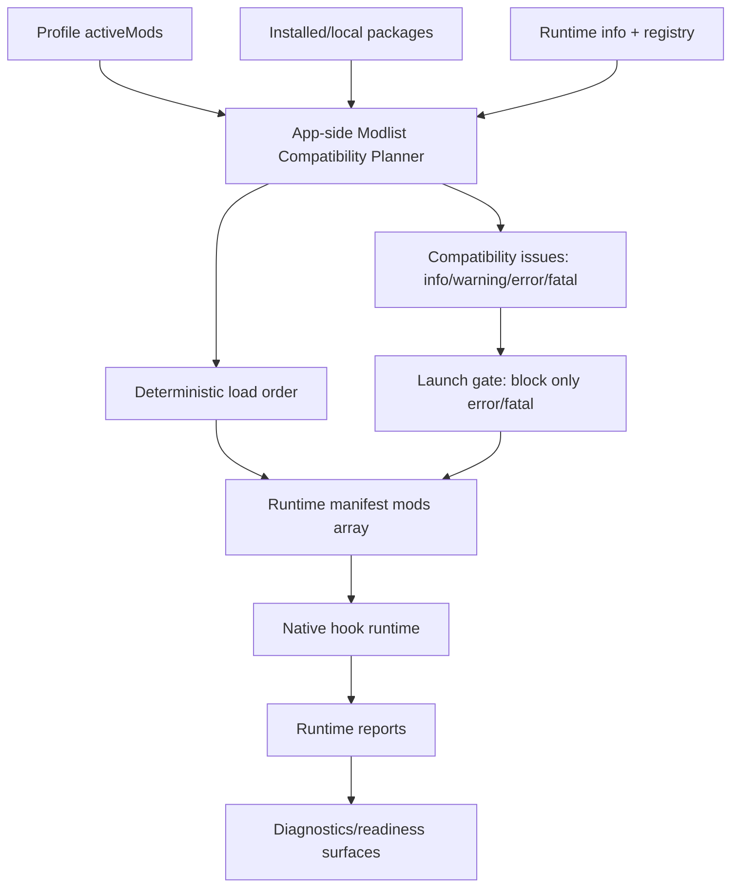

# Architecture Plan: BML Compatible Multi-Mod Pre-Launch Compatibility

## Level 0 — Approved Inputs Loaded

### Source-of-truth inputs

I loaded the `.agents/**/*.md` context before planning. The source-of-truth requirements are the BML profile launch discovery and approved solution direction:

- The approved problem is narrow: users need to assemble a BML modlist, see enabled mods and deterministic load order, see whether issues exist, and launch only when the modlist is compatible before starting Barony (`.agents/discovery/2026-07-07-bml-profile-launch-requirements.md:3-11`).
- Compatibility is explicitly defined as **no error-level issues** (`.agents/discovery/2026-07-07-bml-profile-launch-requirements.md:107-115`).
- Warning-level and lower-severity issues must remain visible/explainable but must not block launch (`.agents/discovery/2026-07-07-bml-profile-launch-requirements.md:113-124`).
- The in-scope pre-launch facts are enabled mods, deterministic load order, issue existence, severity, blocking explanations, and pre-launch launchability confidence for the exact intended modlist (`.agents/discovery/2026-07-07-bml-profile-launch-requirements.md:28-40`).
- Explicit non-goals include current-session loaded-mod truth, post-launch diagnostics, missing-effect diagnosis, local tester workflow expansion, session sharing/export, multiplayer synchronization, UI layouts/mocks, deployment, and rollout (`.agents/discovery/2026-07-07-bml-profile-launch-requirements.md:41-61`).
- The approved solution direction is **Direction B: Declarative Compatibility Contract** (`.agents/solutions/2026-07-07-bml-compatible-modlist-launch.md:258-265`).
- Direction B means package-declared compatibility facts should be the primary source of pre-launch launchability truth, including dependencies/conflicts, load-order needs, capability/runtime requirements, issue severity, and explainable outcomes (`.agents/solutions/2026-07-07-bml-compatible-modlist-launch.md:85-116`).
- Direction E is preserved only as sequencing guidance so the implementation stages the declarative contract instead of becoming a full automatic resolver upfront (`.agents/solutions/2026-07-07-bml-compatible-modlist-launch.md:171-195`, `.agents/solutions/2026-07-07-bml-compatible-modlist-launch.md:364-379`).
- The broader BML product direction is profile-first GUI launcher: the app manages profiles, enabled mods, launch readiness, runtime manifest generation, launch, and diagnostics; native hooks remain behind that surface (`.agents/solutions/2026-07-06-bml-gui-mod-manager.md:75-101`, `.agents/solutions/2026-07-06-bml-gui-mod-manager.md:210-229`).
- No `.agents/mocks/*.md` files exist in this repo state [observed via `glob`].

### Boundary decision for this architecture plan

[INFERENCE] This plan should implement **app-side pre-launch modlist planning and validation** first, not native runtime/session truth. This follows the approved scope boundary (`.agents/discovery/2026-07-07-bml-profile-launch-requirements.md:117-125`) and the runtime contract’s app/runtime split: the app owns package/profile/dependency/conflict validation, profile activation sets, runtime manifest writing, launch, and logs (`framework/BaronyModLoader/loader-runtime-contract.md:20-29`), while the engine runtime reads the app-written manifest and confirms/rejects capabilities at startup (`framework/BaronyModLoader/loader-runtime-contract.md:31-40`).

---

## Level 1 — Domain Model Grounded in Code

### Core entities and relationships

1. **Package**
   - A BML package is an immutable input artifact and does not execute directly (`framework/BaronyModLoader/loader-runtime-contract.md:42-45`).
   - Package behavior is declared in `bml-package.json`; the package format says the app must not infer behavior from arbitrary archive files (`framework/BaronyModLoader/package-format.md:45-46`).
   - Package manifests already contain the compatibility-relevant fields this plan should treat as first-pass declarative facts: capabilities (`framework/BaronyModLoader/package-format.md:145-176`), modules (`framework/BaronyModLoader/package-format.md:178-221`), dependencies/conflicts/load-order hints (`framework/BaronyModLoader/package-format.md:273-311`), and native/runtime requirements (`framework/BaronyModLoader/package-format.md:223-271`).
   - The JSON schema already requires `dependencies`, `conflicts`, and `runtimeReports` at the manifest top level (`framework/BaronyModLoader/schema/package.schema.json:7-24`) and defines `dependencies`, `conflicts`, `loadAfter`, and `loadBefore` fields (`framework/BaronyModLoader/schema/package.schema.json:795-858`).
   - Current package examples already declare dependencies, conflicts, and load-order fields: Stash declares game/runtime dependencies and an exclusive capability-owner conflict (`mods/stash/bml-package.json:259-280`), and Runebound Elixirs declares game/runtime dependencies plus an exclusive active-elixir-effect-state conflict (`mods/runebound-elixirs/bml-package.json:174-196`).

2. **Profile and active mod set**
   - A profile activation record has `activeMods` as a required top-level field (`framework/BaronyModLoader/schema/profile.schema.json:7-8`).
   - Each active mod record currently requires `id`, `version`, and `packagePath`, and may include `manifestPath`, `checksumSet`, `loadOrder`, `enabled`, and `enabledAt` (`framework/BaronyModLoader/schema/profile.schema.json:45-69`).
   - The app reads active mods either from `profile["activeMods"]` or from `<profile>/BaronyModLoader/active-mods.json` (`framework/BaronyModLoader/app/barony_mod_loader.py:2612-2640`).
   - Enabling a profile mod currently appends/replaces a package entry and sorts the active mods by package id (`framework/BaronyModLoader/app/barony_mod_loader.py:2922-2967`, `framework/BaronyModLoader/app/barony_mod_loader.py:3117-3159`).

3. **Current single-package launch guard**
   - The current implementation treats more than one active mod as fatal during package/profile validation (`framework/BaronyModLoader/app/barony_mod_loader.py:2682-2700`).
   - It also exposes a dedicated single-active-package guard that emits `BML_PROFILE_MULTIPLE_ACTIVE_PACKAGES` when `len(active_mods) > 1` (`framework/BaronyModLoader/app/barony_mod_loader.py:2754-2766`).
   - `resolve_profile_launch_package` currently returns exactly one loaded package or fails when there are zero or multiple active mods (`framework/BaronyModLoader/app/barony_mod_loader.py:2769-2818`).
   - Existing BDD encodes this older rule: the package library feature says multiple active packages are blocked before launch (`framework/BaronyModLoader/features/package-library.feature:37-41`), and the step definition constructs Runebound + Stash active together only to verify blocking (`framework/BaronyModLoader/features/steps/package_library_steps.js:413-490`, `framework/BaronyModLoader/features/steps/package_library_steps.js:582-594`).
   - This is the primary source/code conflict with the approved multi-mod launch direction.

4. **Runtime manifest / launch plan**
   - The runtime manifest schema already models `mods` as an array (`framework/BaronyModLoader/schema/runtime-manifest.schema.json:190-203`).
   - Each runtime manifest mod already carries `id`, `version`, `packagePath`, `checksumSet`, `loadOrder`, `capabilities`, and `modules` (`framework/BaronyModLoader/schema/runtime-manifest.schema.json:190-260`).
   - The current builder nevertheless emits a runtime manifest with exactly one package entry and a hard-coded `loadOrder: 10` (`framework/BaronyModLoader/app/barony_mod_loader.py:7871-7953`).
   - `write_launch_artifacts` writes `runtime-manifest.json` and `active-mods.json`, but currently writes only the single package into the generated active-mods artifact (`framework/BaronyModLoader/app/barony_mod_loader.py:7956-8001`).

5. **Issue and severity model**
   - The app already has a `Problem` DTO with `code`, `severity`, `message`, and `details` (`framework/BaronyModLoader/app/barony_mod_loader.py:209-218`).
   - The app already treats `error` and `fatal` as launch-blocking severities through `Problem.is_error` (`framework/BaronyModLoader/app/barony_mod_loader.py:216-218`) and `ValidationResult.ok` (`framework/BaronyModLoader/app/barony_mod_loader.py:276-286`).
   - The runtime contract requires app/runtime errors to include stable code, severity, package/capability/module context where applicable, human-readable message, machine-readable details, and repair/block guidance (`framework/BaronyModLoader/loader-runtime-contract.md:271-283`).
   - The profile schema’s validation error enum already permits `info`, `warning`, `error`, and `fatal` (`framework/BaronyModLoader/schema/profile.schema.json:152-156`).

6. **Runtime capability boundary**
   - Packages request engine capabilities, and the app compares those requests to runtime metadata (`framework/BaronyModLoader/package-format.md:145-176`, `framework/BaronyModLoader/loader-runtime-contract.md:152-184`).
   - `validate_runtime_info` currently checks one package against runtime contract/version/capabilities and emits fatal runtime compatibility problems for missing capabilities or unsupported versions (`framework/BaronyModLoader/app/barony_mod_loader.py:1472-1558`).
   - Registered runtime selection also validates one package at a time (`framework/BaronyModLoader/app/barony_mod_loader.py:9164-9376`).

### Domain invariants to preserve

- Enabled-mod truth comes from the selected profile’s active mods, not runtime/session state (`.agents/discovery/2026-07-07-bml-profile-launch-requirements.md:117-125`; `framework/BaronyModLoader/app/barony_mod_loader.py:2633-2640`).
- Compatibility means no error/fatal issues in the pre-launch plan (`.agents/discovery/2026-07-07-bml-profile-launch-requirements.md:107-115`; `framework/BaronyModLoader/app/barony_mod_loader.py:216-218`).
- Warnings must remain visible/explainable and must not block launch (`.agents/discovery/2026-07-07-bml-profile-launch-requirements.md:113-124`; `framework/BaronyModLoader/app/barony_mod_loader.py:276-286`).
- Runtime manifest contents must include only resolved, validated package data and must not include disabled mods or unchecked package paths (`framework/BaronyModLoader/loader-runtime-contract.md:86-140`).
- The engine runtime must not scan arbitrary package folders for behavior; the app resolves packages and emits a read-only manifest (`framework/BaronyModLoader/loader-runtime-contract.md:7-15`).

### User flow touched by this task

1. User enables multiple packages in a profile; current code already stores multiple entries but later rejects them (`framework/BaronyModLoader/app/barony_mod_loader.py:2922-2967`, `framework/BaronyModLoader/app/barony_mod_loader.py:2769-2818`).
2. User asks for launch readiness / launch plan / launch; current CLI requires `--package`, which selects one package rather than the whole active profile modlist (`framework/BaronyModLoader/app/barony_mod_loader.py:9668-9678`).
3. App should load all enabled packages, derive deterministic load order, evaluate package-declared compatibility facts, produce issues with severity, block only error/fatal issues, and write a multi-mod runtime manifest (`.agents/discovery/2026-07-07-bml-profile-launch-requirements.md:92-105`; `framework/BaronyModLoader/schema/runtime-manifest.schema.json:190-260`).

---

## Level 2 — System Architecture

### Architecture boundaries

- **Standalone app boundary:** install discovery, package verification, profile activation, dependency/conflict resolution, load-order planning, runtime selection, runtime manifest writing, launch, logs, and app-side diagnostics belong in the app (`framework/BaronyModLoader/README.md:7-24`; `framework/BaronyModLoader/loader-runtime-contract.md:20-29`).
- **Package boundary:** packages are immutable artifacts and behavior comes from `bml-package.json`, not arbitrary file inference (`framework/BaronyModLoader/loader-runtime-contract.md:42-45`; `framework/BaronyModLoader/package-format.md:45-46`).
- **Runtime boundary:** the hook runtime reads the manifest, validates supported contract/capability versions, activates supported hooks, and writes reports (`framework/BaronyModLoader/loader-runtime-contract.md:31-40`; `framework/BaronyModLoader/loader-runtime-contract.md:186-198`).
- **Manifest boundary:** the app writes one complete runtime manifest before launch (`framework/BaronyModLoader/loader-runtime-contract.md:86-103`), and that manifest already has a `mods` array suitable for multiple resolved packages (`framework/BaronyModLoader/schema/runtime-manifest.schema.json:190-260`).
- **GUI boundary:** existing GUI/readiness functions are semantic DTO-first, not direct widget logic; package catalog and readiness return structured statuses/problems rather than raw CLI output (`framework/BaronyModLoader/app/barony_mod_loader.py:8037-8127`, `framework/BaronyModLoader/app/barony_mod_loader.py:8186-8231`). This task should update those DTOs but should not design UI layouts (`.agents/solutions/2026-07-07-bml-compatible-modlist-launch.md:297-319`).

### Current data flow that must change

- Current `launch-plan` and `launch` commands require a single `--package` argument (`framework/BaronyModLoader/app/barony_mod_loader.py:9668-9678`).
- Current launch validation loads that one package, validates it, validates the profile only against that package, selects runtime for that package, writes one package to the manifest, and launches (`framework/BaronyModLoader/app/barony_mod_loader.py:9431-9568`).
- Current GUI launch dry-run and GUI launch path call `resolve_profile_launch_package`, so they inherit the single-active-package guard (`framework/BaronyModLoader/app/barony_mod_loader.py:5333-5395`, `framework/BaronyModLoader/app/barony_mod_loader.py:5526-5622`).

### Target data flow

[INFERENCE] Introduce a pure app-core **Modlist Compatibility Plan** as the single source passed to CLI, GUI DTOs, runtime selection, and runtime manifest generation:

1. Load profile active mods from `profile["activeMods"]` or `active-mods.json` using the existing authoritative-mod logic (`framework/BaronyModLoader/app/barony_mod_loader.py:2633-2640`).
2. Load every active package path with existing package loading/validation primitives (`framework/BaronyModLoader/app/barony_mod_loader.py:625-647`, `framework/BaronyModLoader/app/barony_mod_loader.py:1223-1392`).
3. Extract declarative compatibility facts from each package: dependencies, conflicts, loadAfter/loadBefore, engine capabilities, native/runtime requirements, and package/app/game/runtime metadata (`framework/BaronyModLoader/package-format.md:145-311`; `framework/BaronyModLoader/package-format.md:527-550`).
4. Compute deterministic load order and issue list.
5. Define `launchable = no issue where severity in {"error", "fatal"}` using the existing severity model (`framework/BaronyModLoader/app/barony_mod_loader.py:216-218`, `framework/BaronyModLoader/app/barony_mod_loader.py:281-286`).
6. Write all resolved/validated enabled packages into the manifest `mods` array in computed load order (`framework/BaronyModLoader/schema/runtime-manifest.schema.json:190-260`).

---

## Level 3 — Solution Shape and Tradeoffs

### Recommendation

[INFERENCE] Implement Direction B as an **app-side Declarative Compatibility Contract evaluator** backed by existing package-declared fields, and stage it with Direction E discipline:

- Use existing package fields as the first contract surface: `dependencies`, `conflicts`, `loadAfter`, `loadBefore`, `engine.capabilities`, `framework.minimumAppVersion`, `barony.supportedGameVersions`, `engine.runtimeContract`, `engine.minimumRuntimeVersion`, and `native` platform/runtime facts (`framework/BaronyModLoader/schema/package.schema.json:795-858`; `framework/BaronyModLoader/package-format.md:145-311`).
- Add an internal `ModlistCompatibilityPlan` DTO rather than starting with a full resolver or remote compatibility database, because the approved solution explicitly rejects full automatic resolver scope as first implementation (`.agents/solutions/2026-07-07-bml-compatible-modlist-launch.md:145-169`, `.agents/solutions/2026-07-07-bml-compatible-modlist-launch.md:313-328`).
- Treat hard declared fact violations as error/fatal issues and treat incomplete non-critical facts as warnings, because warnings must stay visible while still allowing launch (`.agents/discovery/2026-07-07-bml-profile-launch-requirements.md:113-124`).
- Keep runtime manifest generation app-owned and data-only; do not make the engine scan packages or resolve dependencies (`framework/BaronyModLoader/loader-runtime-contract.md:7-15`, `framework/BaronyModLoader/loader-runtime-contract.md:86-140`).

### Minimum first-pass package-declared compatibility facts

The first implementation should evaluate these facts:

1. **Enabled set** from profile active mods: source is profile state, not selected CLI package (`framework/BaronyModLoader/app/barony_mod_loader.py:2612-2640`).
2. **Package identity/version/path/checksum** from each active mod and loaded package (`framework/BaronyModLoader/schema/profile.schema.json:45-69`; `framework/BaronyModLoader/app/barony_mod_loader.py:2662-2679`).
3. **Dependencies** from `dependencies[]`, including `kind: package`, `kind: capability`, `kind: app`, `kind: game`, and `kind: engine-runtime` (`framework/BaronyModLoader/schema/package.schema.json:1456-1488`).
4. **Conflicts** from `conflicts[]`, including package conflicts and exclusive-capability-owner conflicts (`framework/BaronyModLoader/schema/package.schema.json:821-846`; `mods/stash/bml-package.json:273-279`; `mods/runebound-elixirs/bml-package.json:188-193`).
5. **Load-order constraints** from `loadAfter[]`, `loadBefore[]`, and required package dependency edges (`framework/BaronyModLoader/schema/package.schema.json:847-858`; `framework/BaronyModLoader/package-format.md:273-311`).
6. **Runtime capability support** from package `engine.capabilities[]` and selected runtime info capabilities (`framework/BaronyModLoader/app/barony_mod_loader.py:662-673`; `framework/BaronyModLoader/app/barony_mod_loader.py:1451-1558`).
7. **Native/platform fail-closed facts** from registered runtime validation and existing Windows fail-closed logic (`framework/BaronyModLoader/app/barony_mod_loader.py:9164-9351`; `native/barony-modloader-hook/README.md:16-21`).

### Severity policy

[INFERENCE] Use the current `Problem` severity model directly, with these first-pass mappings:

- **Error/fatal, launch-blocking:** invalid active package path, package parse/validation errors, duplicate active package id ambiguity, missing required package dependency, unsatisfied required package dependency version, declared package conflict, exclusive capability-owner conflict, load-order cycle, missing required runtime capability, unsupported runtime contract/version, unverified required native runtime.
- **Warning, launch-allowed:** optional dependency absent, load-order hint references a package that is not enabled, incomplete/non-explicit compatibility facts when no hard violation is known, unverifiable-but-non-fatal provenance warnings already emitted by runtime registration validation (`framework/BaronyModLoader/app/barony_mod_loader.py:9321-9331`).
- **Info, launch-allowed:** deterministic fallback order chosen where no package-declared constraints apply.

This mapping is consistent with the discovery gating policy (`.agents/discovery/2026-07-07-bml-profile-launch-requirements.md:107-124`) and current app semantics where `error`/`fatal` fail `ValidationResult.ok` while warnings do not (`framework/BaronyModLoader/app/barony_mod_loader.py:216-218`, `framework/BaronyModLoader/app/barony_mod_loader.py:281-286`).

### Deterministic load order

[INFERENCE] Compute load order as a directed acyclic graph, then assign stable integer `loadOrder` values:

- Edge `A -> B` when package B has a required package dependency on A.
- Edge `A -> B` when B declares `loadAfter: [A]`.
- Edge `A -> B` when A declares `loadBefore: [B]`.
- Tie-break unconstrained packages by profile `loadOrder` if present, then package id, version, and package path; profile active mod entries already allow `loadOrder` (`framework/BaronyModLoader/schema/profile.schema.json:45-69`), and current profile enable has a deterministic package-id sort fallback (`framework/BaronyModLoader/app/barony_mod_loader.py:2959-2962`).
- A cycle becomes an error-level issue because a deterministic order cannot be derived (`.agents/discovery/2026-07-07-bml-profile-launch-requirements.md:117-124`).

### Top alternative considered

**Alternative:** Keep a single selected package for launch and only warn when the profile has multiple active packages.

- This matches current code structure, because `launch` and `launch-plan` require one `--package` and validate one package (`framework/BaronyModLoader/app/barony_mod_loader.py:9431-9568`, `framework/BaronyModLoader/app/barony_mod_loader.py:9668-9678`).
- It is rejected because it cannot represent the exact enabled modlist or deterministic load order for multiple enabled mods, which are CR-1 and CR-2 in the approved discovery (`.agents/discovery/2026-07-07-bml-profile-launch-requirements.md:131-142`).

**Alternative:** Build a full automatic resolver now.

- This is rejected by the approved solution direction, which preserves full resolver behavior only as a long-term option and says architecture must not assume full resolver scope is approved (`.agents/solutions/2026-07-07-bml-compatible-modlist-launch.md:145-169`, `.agents/solutions/2026-07-07-bml-compatible-modlist-launch.md:381-388`).

---

## Level 4 — Implementation Zoom: App-Core Compatibility Planner

### Existing patterns to reuse

- Reuse `Problem`, `ValidationResult`, `problem_to_dict`, and `validation_status` for all issue surfaces rather than creating a parallel issue vocabulary (`framework/BaronyModLoader/app/barony_mod_loader.py:209-218`, `framework/BaronyModLoader/app/barony_mod_loader.py:276-289`, `framework/BaronyModLoader/app/barony_mod_loader.py:8020-8034`).
- Reuse package loading and validation so invalid package manifests become structured problems (`framework/BaronyModLoader/app/barony_mod_loader.py:625-647`, `framework/BaronyModLoader/app/barony_mod_loader.py:1223-1392`).
- Reuse active mod source precedence from `profile_authoritative_mods` (`framework/BaronyModLoader/app/barony_mod_loader.py:2633-2640`).
- Reuse package checksum comparison from `active_mod_checksum_for_package` and `plan_runtime_manifest` for stale-package warnings/blockers (`framework/BaronyModLoader/app/barony_mod_loader.py:8134-8183`).

### Required change

[INFERENCE] Replace the single-package launch path with a modlist-plan path while keeping single-package functions only as compatibility wrappers for package-specific commands.

- Current blockers at `validate_profile_package_enabled`, `validate_profile_single_active_package`, and `resolve_profile_launch_package` must no longer be used by `launch`, `launch-plan`, GUI BML launch, or readiness when there are multiple active packages (`framework/BaronyModLoader/app/barony_mod_loader.py:2682-2818`, `framework/BaronyModLoader/app/barony_mod_loader.py:5333-5395`, `framework/BaronyModLoader/app/barony_mod_loader.py:5526-5622`).
- A new pure planner should produce a DTO shaped for both CLI and GUI:
  - `enabledMods`: active profile entries after normalization.
  - `packages`: loaded package summaries.
  - `loadOrder`: ordered package ids with integer positions.
  - `issues`: structured list of `{code, severity, message, packageId?, details}` using existing `Problem` semantics.
  - `blockingIssues`: issues where severity is `error` or `fatal`.
  - `nonBlockingIssues`: warnings/info.
  - `launchable`: true only when no blocking issues exist.
  - `runtimeRequirements`: union of required capabilities/contract/runtime facts.
  - `manifestMods`: resolved mod entries for `runtime-manifest.json`.

---

## Level 5 — Implementation Zoom: Declarative Fact Evaluation

### Dependencies

- Current dependency schema allows `kind` values `game`, `engine-runtime`, `app`, `package`, and `capability` (`framework/BaronyModLoader/schema/package.schema.json:1456-1488`).
- Existing manifests use range strings such as `>=4.0.0` and `>=0.1.0 <0.2.0` (`mods/stash/bml-package.json:259-271`; `mods/runebound-elixirs/bml-package.json:174-186`).
- Current `version_satisfies` accepts only plain semver strings and returns false when either side is not semver-ish (`framework/BaronyModLoader/app/barony_mod_loader.py:557-562`).

[INFERENCE] Add a minimal package-version constraint evaluator for the manifest range forms already used in this repo: exact `x.y.z`, `>=x.y.z`, `<x.y.z`, and whitespace-separated conjunctions like `>=0.1.0 <0.2.0`. Do not build a full npm-style semver resolver in this first scope.

### Conflicts

- Package conflicts are explicit so the app can explain why a profile cannot launch (`framework/BaronyModLoader/package-format.md:273-311`).
- Existing conflict examples use `kind: exclusive-capability-owner` with ids like `*.void_chest_binding` and `*.active_elixir_effect_state` (`mods/stash/bml-package.json:273-279`; `mods/runebound-elixirs/bml-package.json:188-193`).

[INFERENCE] First-pass conflict evaluation should support:

- Exact package id conflict when `kind: package` and another enabled package id matches.
- Glob-style package/capability pattern conflict for existing manifest ids containing `*`.
- Exclusive capability-owner conflict when two enabled packages both claim the same exclusive capability/binding. Use `engine.capabilities[]` plus module descriptors with `exclusive: true` as the first data source because Stash declares exclusive Void Chest bindings in modules (`mods/stash/bml-package.json:126-150`).

### Missing/incomplete facts degradation

[INFERENCE] Missing non-critical compatibility facts should degrade to warnings, not errors, in the first staged contract because the approved launch gate only blocks error-level issues (`.agents/discovery/2026-07-07-bml-profile-launch-requirements.md:113-124`) and Direction E is explicitly preserved to avoid overbuilding a full resolver upfront (`.agents/solutions/2026-07-07-bml-compatible-modlist-launch.md:171-195`).

Examples:

- A package with no load-order hints and no dependency edges can still be deterministically ordered by stable fallback and should receive an info/warning explanation rather than a block.
- A `loadAfter` reference to a non-enabled package should be warning-level unless the same package declares that target as a required dependency.
- A missing required package dependency is error-level because a declared required compatibility fact cannot be satisfied.

---

## Level 6 — Implementation Zoom: Launch/GUI/Runtime Manifest Integration

### CLI launch/launch-plan

- Current `launch-plan` validates a single package and writes artifacts for that package (`framework/BaronyModLoader/app/barony_mod_loader.py:9431-9466`).
- Current `launch` validates a single package, selects runtime for that package, writes artifacts for that package, and runs the selected executable (`framework/BaronyModLoader/app/barony_mod_loader.py:9469-9568`).
- Current parser requires `--package` for both commands (`framework/BaronyModLoader/app/barony_mod_loader.py:9668-9678`).

[INFERENCE] Change `launch-plan` and `launch` to operate on the selected profile’s enabled modlist. Keep `--package` only as an optional assertion/filter during migration if needed, but do not let it define the launch target when profile active mods are present.

### GUI semantic state

- Current GUI dry-run and launch paths resolve one launch package from the profile (`framework/BaronyModLoader/app/barony_mod_loader.py:5333-5395`, `framework/BaronyModLoader/app/barony_mod_loader.py:5526-5622`).
- Current readiness state accepts one package object and builds a readiness matrix around install/profile/package/runtime inputs (`framework/BaronyModLoader/app/barony_mod_loader.py:8186-8231`, `framework/BaronyModLoader/app/barony_mod_loader.py:8276-8352`).
- Current package library state blocks multiple active packages in `disabledReasons` (`framework/BaronyModLoader/app/barony_mod_loader.py:8101-8127`).

[INFERENCE] Update GUI semantic DTOs to expose `modlistPlan`, `enabledMods`, `loadOrder`, `issues`, `blockingIssues`, and `warnings` without changing layout/mock design.

### Runtime manifest and native runtime

- Runtime manifest schema already supports multiple `mods[]` entries (`framework/BaronyModLoader/schema/runtime-manifest.schema.json:190-260`).
- Native report code already detects both `jml.stash` and `jml.runebound-elixirs` in a manifest and can write both into `loadedMods` when runtime hooks succeed (`native/barony-modloader-hook/src/bml_hook.c:832-865`, `native/barony-modloader-hook/src/bml_hook.c:1990-2004`).
- The engine runtime must not scan packages directly (`framework/BaronyModLoader/loader-runtime-contract.md:7-15`).

[INFERENCE] The first implementation should not add a generic native resolver. It should emit multiple resolved manifest mod entries from the app and let current runtime capability checks/reporting remain fail-closed for supported modules.

---

## Discovery Coverage Check

| Requirement | Addressed by implementation steps | Coverage rationale |
|---|---:|---|
| CR-1 — Represent exact enabled mods | Steps 1, 2, 5, 7, 10 | Planner uses profile active mods as source of truth and exposes `enabledMods` (`.agents/discovery/2026-07-07-bml-profile-launch-requirements.md:131-134`). |
| CR-2 — Represent deterministic load order | Steps 3, 6, 7, 10 | DAG/tie-break order becomes `loadOrder` in plan and manifest (`.agents/discovery/2026-07-07-bml-profile-launch-requirements.md:133-135`). |
| CR-3 — Determine whether modlist has issues | Steps 2, 3, 4, 5, 6, 8, 10 | Planner aggregates package, dependency, conflict, runtime, and load-order issues (`.agents/discovery/2026-07-07-bml-profile-launch-requirements.md:135-136`). |
| CR-4 — Classify issues by severity | Steps 1, 4, 8, 10 | Uses existing `Problem.severity` with info/warning/error/fatal (`.agents/discovery/2026-07-07-bml-profile-launch-requirements.md:136-140`; `framework/BaronyModLoader/app/barony_mod_loader.py:209-218`). |
| CR-5 — Define compatibility as no error-level issues | Steps 1, 4, 5, 10 | `launchable` derives from no error/fatal issues (`.agents/discovery/2026-07-07-bml-profile-launch-requirements.md:137-138`). |
| CR-6 — Block launch on error-level issues | Steps 8, 9, 10 | CLI/GUI launch consume `launchable` and block on error/fatal only (`.agents/discovery/2026-07-07-bml-profile-launch-requirements.md:138-139`). |
| CR-7 — Allow launch with only warnings/lower severity | Steps 4, 8, 9, 10 | Warnings remain non-blocking by `ValidationResult.ok` semantics (`.agents/discovery/2026-07-07-bml-profile-launch-requirements.md:139-140`; `framework/BaronyModLoader/app/barony_mod_loader.py:281-286`). |
| CR-8 — Keep warning/lower issues visible/explainable | Steps 1, 4, 8, 10, 11 | Plan and validation report expose warning/info issues (`.agents/discovery/2026-07-07-bml-profile-launch-requirements.md:140-141`). |
| CR-9 — Explain non-launchable modlists using error-level issues | Steps 4, 5, 8, 9, 10 | Blocking issues are structured with stable codes/messages/details (`.agents/discovery/2026-07-07-bml-profile-launch-requirements.md:141-142`; `framework/BaronyModLoader/loader-runtime-contract.md:271-283`). |
| CR-10 — Pre-launch confidence without post-launch diagnostics | Steps 1-10 | Planner runs before launch from package/profile/runtime facts, not runtime/session truth (`.agents/discovery/2026-07-07-bml-profile-launch-requirements.md:142-143`). |
| CR-11 — Avoid excluded domains | All steps | Plan avoids UI design, session sharing, multiplayer sync, post-launch truth, missing-effect diagnosis, and rollout (`.agents/discovery/2026-07-07-bml-profile-launch-requirements.md:41-61`). |

---

## Suggested `.agents/` Updates

- **File:** `system-map.md` — **Add:** App-core currently has `activeMods` profile storage and a runtime manifest `mods[]` array, but launch/GUI paths still enforce a single active package (`framework/BaronyModLoader/app/barony_mod_loader.py:2682-2818`, `framework/BaronyModLoader/schema/runtime-manifest.schema.json:190-260`).
- **File:** `decisions.md` — **Add:** First-pass Declarative Compatibility Contract should use existing package-declared fields (`dependencies`, `conflicts`, `loadAfter`, `loadBefore`, `engine.capabilities`, native/runtime facts) before adding a remote registry or full resolver (`framework/BaronyModLoader/package-format.md:145-311`; `.agents/solutions/2026-07-07-bml-compatible-modlist-launch.md:321-328`).
- **File:** `constraints.md` — **Add:** Missing/incomplete non-critical compatibility facts degrade to visible warnings in first scope; required declared fact violations remain error-level launch blockers (`.agents/discovery/2026-07-07-bml-profile-launch-requirements.md:113-124`; `.agents/solutions/2026-07-07-bml-compatible-modlist-launch.md:171-195`).

---

## Final Level — Ordered Atomic Implementation Steps

### 1. Add the modlist issue/plan DTO surface

- **File:** `framework/BaronyModLoader/app/barony_mod_loader.py:209-289`
- **What:** Extend the existing app-core DTO layer around `Problem`/`ValidationResult` with pure modlist-plan helpers that expose enabled mods, ordered mods, issues, blocking issues, non-blocking issues, and `launchable`. Do not create a second severity vocabulary; reuse `Problem.severity` and `Problem.is_error`.
- **Why:** Satisfies CR-3, CR-4, CR-5, CR-8, and CR-9 by making issue severity and launchability explicit before launch (`.agents/discovery/2026-07-07-bml-profile-launch-requirements.md:131-142`). Reuse is appropriate because the current app already models severity and blocking semantics (`framework/BaronyModLoader/app/barony_mod_loader.py:209-218`, `framework/BaronyModLoader/app/barony_mod_loader.py:276-286`).
- **Depends on:** None.
- **Tests:** Add unit assertions in `framework/BaronyModLoader/tests/test_loader_security.py` that a plan with only warnings is launchable and a plan with any error/fatal issue is not.

### 2. Replace single-active package resolution with active modlist package resolution

- **File:** `framework/BaronyModLoader/app/barony_mod_loader.py:2612-2818`
- **What:** Add a resolver that loads every active mod from `profile_authoritative_mods`, validates each active entry’s path/version/checksum against the loaded package, and returns all loaded packages plus structured issues. Keep `active_mod_package_id`, `active_mod_package_path`, and `validate_enabled_package_path` as reusable primitives, but stop using `validate_profile_single_active_package` / `resolve_profile_launch_package` in launch and GUI paths.
- **Why:** Current code fatally rejects multiple active packages (`framework/BaronyModLoader/app/barony_mod_loader.py:2689-2700`, `framework/BaronyModLoader/app/barony_mod_loader.py:2754-2818`), which contradicts the approved multi-mod pre-launch requirement (`.agents/discovery/2026-07-07-bml-profile-launch-requirements.md:30-40`).
- **Depends on:** Step 1.
- **Tests:** Update `test_launch_rejects_disabled_package_when_profile_has_active_mod_state`, `test_launch_rejects_new_profile_empty_active_mods`, and `test_launch_rejects_enabled_package_path_mismatch` in `framework/BaronyModLoader/tests/test_loader_security.py:546-632` to use modlist-plan semantics; add a new test where two valid active packages are accepted as the enabled modlist.

### 3. Implement deterministic load-order planning

- **File:** `framework/BaronyModLoader/app/barony_mod_loader.py:2612-2818` and `framework/BaronyModLoader/app/barony_mod_loader.py:8134-8183`
- **What:** Add pure load-order planning over the resolved active package set. Use edges from required package dependencies, `loadAfter`, and `loadBefore`; tie-break by active mod `loadOrder`, then package id, version, and package path. Emit stable integer `loadOrder` values into the plan.
- **Why:** CR-2 requires deterministic load order (`.agents/discovery/2026-07-07-bml-profile-launch-requirements.md:133-135`). The schema already has `loadAfter`/`loadBefore` package fields (`framework/BaronyModLoader/schema/package.schema.json:847-858`) and active mod entries already allow `loadOrder` (`framework/BaronyModLoader/schema/profile.schema.json:45-69`).
- **Depends on:** Step 2.
- **Tests:** Add unit cases for unconstrained deterministic ordering, `loadAfter`, `loadBefore`, required dependency ordering, missing load-order reference warning, and load-order cycle error.

### 4. Implement dependency evaluation from declared package facts

- **File:** `framework/BaronyModLoader/app/barony_mod_loader.py:546-575`, `framework/BaronyModLoader/app/barony_mod_loader.py:1223-1392`, `framework/BaronyModLoader/schema/package.schema.json:1456-1488`
- **What:** Add a minimal dependency evaluator for `kind: package`, `kind: app`, `kind: game`, `kind: engine-runtime`, and `kind: capability`. Extend version constraint handling to support exact semver, `>=x.y.z`, `<x.y.z`, and whitespace-conjoined ranges already used by current manifests. Required missing/unsatisfied dependencies become error-level issues; optional missing dependencies become warning-level issues.
- **Why:** Dependencies are part of the existing package contract and explicit compatibility explanation model (`framework/BaronyModLoader/package-format.md:273-311`). Current manifests already use range expressions that `version_satisfies` cannot parse (`mods/stash/bml-package.json:259-271`; `framework/BaronyModLoader/app/barony_mod_loader.py:557-562`).
- **Depends on:** Steps 1-2.
- **Tests:** Add tests for missing required package dependency, optional package dependency warning, app/runtime/game version range satisfaction, and a range parse case for `>=0.1.0 <0.2.0`.

### 5. Implement conflict and exclusive-owner evaluation

- **File:** `framework/BaronyModLoader/app/barony_mod_loader.py:1223-1392`, `mods/stash/bml-package.json:126-150`, `mods/stash/bml-package.json:273-279`, `mods/runebound-elixirs/bml-package.json:188-193`
- **What:** Add first-pass conflict evaluation for exact package conflicts, glob-like conflict ids containing `*`, and `kind: exclusive-capability-owner`. Detect exclusive collisions using package conflict declarations, engine capabilities, and module descriptors with `exclusive: true`.
- **Why:** Package format says conflicts are explicit so the app can explain why a profile cannot launch (`framework/BaronyModLoader/package-format.md:273-311`). Current Stash and Runebound packages already declare exclusive-owner conflicts (`mods/stash/bml-package.json:273-279`; `mods/runebound-elixirs/bml-package.json:188-193`).
- **Depends on:** Steps 1-2.
- **Tests:** Add unit cases for exact package conflict, wildcard exclusive-capability-owner conflict, no-conflict Stash + Runebound combination, and human-readable conflict issue details.

### 6. Build the compatibility plan as the app-core launchability source

- **File:** `framework/BaronyModLoader/app/barony_mod_loader.py:8037-8231`
- **What:** Add a public pure app-core function such as `build_modlist_compatibility_plan` / `plan_profile_modlist` and thread it into package-library/readiness DTO generation. The plan must expose enabled mods, deterministic load order, `issues`, `blockingIssues`, `warnings`, and `launchable`.
- **Why:** Current package library and readiness surfaces are already semantic DTOs (`framework/BaronyModLoader/app/barony_mod_loader.py:8037-8127`, `framework/BaronyModLoader/app/barony_mod_loader.py:8186-8231`), so the compatibility plan should be exposed there rather than embedded in CLI text or UI widgets.
- **Depends on:** Steps 2-5.
- **Tests:** Update BDD in `framework/BaronyModLoader/features/package-library.feature:37-41` so compatible multi-active profiles are planned instead of blocked, and add a separate conflict scenario that is blocked for a real error-level issue.

### 7. Adapt runtime capability validation and runtime selection to modlists

- **File:** `framework/BaronyModLoader/app/barony_mod_loader.py:1451-1558`, `framework/BaronyModLoader/app/barony_mod_loader.py:9164-9376`
- **What:** Add a runtime-info validation path that evaluates the union of required capabilities/runtime contracts across all packages in the modlist plan. Update registered runtime selection to choose a runtime only if it satisfies every required package capability/version in the plan. Preserve existing Windows fail-closed verification behavior.
- **Why:** Current runtime validation is per-package (`framework/BaronyModLoader/app/barony_mod_loader.py:1472-1558`) and runtime selection validates one package (`framework/BaronyModLoader/app/barony_mod_loader.py:9164-9376`). Multi-mod launch must validate the whole enabled set before launch (`.agents/discovery/2026-07-07-bml-profile-launch-requirements.md:117-124`).
- **Depends on:** Step 6.
- **Tests:** Add tests where runtime supports both packages, misses one required capability from one package, and preserves a warning-only runtime provenance warning without blocking.

### 8. Generate multi-mod runtime manifests and validation reports

- **File:** `framework/BaronyModLoader/app/barony_mod_loader.py:7871-8001`
- **What:** Change `build_runtime_manifest` and `write_launch_artifacts` to accept a modlist plan or ordered package list. Emit one `mods[]` entry per enabled launchable package with computed `loadOrder`, package checksum, capabilities, and modules. Write `active-mods.json` with the same enabled set and load-order values. Write or update `BaronyModLoader/validation-report.json` with the plan issues and launchability outcome.
- **Why:** Runtime manifest schema already supports a `mods` array (`framework/BaronyModLoader/schema/runtime-manifest.schema.json:190-260`), but current code emits one hard-coded mod entry (`framework/BaronyModLoader/app/barony_mod_loader.py:7932-7953`) and one generated active-mod entry (`framework/BaronyModLoader/app/barony_mod_loader.py:7984-7999`). The runtime contract says app-written files include `active-mods.json`, `runtime-manifest.json`, and `validation-report.json` (`framework/BaronyModLoader/loader-runtime-contract.md:316-327`).
- **Depends on:** Steps 6-7.
- **Tests:** Add unit tests that runtime manifest contains both Stash and Runebound in deterministic order and that `validation-report.json` includes warnings without blocking.

### 9. Change CLI launch and launch-plan to use the profile modlist

- **File:** `framework/BaronyModLoader/app/barony_mod_loader.py:9431-9568`, `framework/BaronyModLoader/app/barony_mod_loader.py:9668-9678`
- **What:** Make `launch-plan` and `launch` derive the launch target from profile active mods. Remove the requirement that `--package` select the launch target; if retained during migration, make it optional and only an assertion that a package is included. Block launch only when the modlist plan has error/fatal issues.
- **Why:** Current commands require a single package argument and validate one package (`framework/BaronyModLoader/app/barony_mod_loader.py:9431-9568`, `framework/BaronyModLoader/app/barony_mod_loader.py:9668-9678`), but CR-1 requires representing the exact enabled modlist (`.agents/discovery/2026-07-07-bml-profile-launch-requirements.md:131-134`).
- **Depends on:** Steps 6-8.
- **Tests:** Add CLI tests for `launch-plan <profile> --runtime-info ...` without `--package`, dry-run launch with two compatible active packages, launch blocked by conflict, and launch allowed with warning-only issues.

### 10. Update GUI semantic launch/readiness state without UI design

- **File:** `framework/BaronyModLoader/app/barony_mod_loader.py:5307-5622`, `framework/BaronyModLoader/app/barony_mod_loader.py:8276-8352`
- **What:** Replace GUI dry-run/BML launch calls to `resolve_profile_launch_package` with the modlist compatibility plan. Expose plan fields in existing semantic state: `enabledMods`, `loadOrder`, `issues`, `blockingIssues`, `warnings`, `launchable`, and `disabledReasons`. Preserve current launch-button behavior by blocking only when `launchable` is false; do not change screen layout.
- **Why:** Existing GUI launch/readiness paths inherit the single-package guard (`framework/BaronyModLoader/app/barony_mod_loader.py:5333-5395`, `framework/BaronyModLoader/app/barony_mod_loader.py:5526-5622`). Warning visibility is required, but UI layout is out of scope (`.agents/discovery/2026-07-07-bml-profile-launch-requirements.md:41-61`).
- **Depends on:** Steps 6-9.
- **Tests:** Update GUI/BDD smoke assertions that currently expect multiple-active blockers, especially `framework/BaronyModLoader/features/steps/gui_button_interaction_steps.js:1355-1359`, to expect specific error blockers only when compatibility plan has blocking issues.

### 11. Update schemas to reflect planned multi-mod outputs

- **File:** `framework/BaronyModLoader/schema/profile.schema.json:45-69`, `framework/BaronyModLoader/schema/runtime-manifest.schema.json:190-260`, `framework/BaronyModLoader/schema/package.schema.json:795-858`
- **What:** Ensure profile active mod schema can store all module names used by active packages, including `runeboundElixirs` if active mod entries expose modules. Keep runtime manifest `mods[]` multi-entry shape; add any missing validation-report/modlist-plan schema only if implementation writes a separately validated `validation-report.json`. Do not require a new top-level package `compatibility` object in this first pass unless tests prove existing fields cannot express required facts.
- **Why:** Existing runtime manifest schema already supports multiple mods (`framework/BaronyModLoader/schema/runtime-manifest.schema.json:190-260`), while profile schema’s active mod `modules` enum currently lists only Stash-era modules and omits `runeboundElixirs` (`framework/BaronyModLoader/schema/profile.schema.json:64-67`). Direction E sequencing says stage the contract rather than add a full resolver/schema universe upfront (`.agents/solutions/2026-07-07-bml-compatible-modlist-launch.md:171-195`).
- **Depends on:** Steps 6-8.
- **Tests:** Validate schema acceptance for active profiles containing both Stash and Runebound active entries and validate generated runtime manifests with both packages.

### 12. Update BDD feature contracts from single-active guard to compatibility gate

- **File:** `framework/BaronyModLoader/features/package-library.feature:37-41`, `framework/BaronyModLoader/features/launch-readiness.feature:15-31`, `framework/BaronyModLoader/features/core-runtime-manifest-planner.feature:10-14`, and corresponding step files under `framework/BaronyModLoader/features/steps/`
- **What:** Replace “multiple active packages block” as a blanket rule with scenarios for: compatible multi-mod plan accepted; conflict blocks launch; warnings visible but launchable; deterministic load order present; generated runtime manifest includes all enabled launchable mods.
- **Why:** Current BDD encodes the old single-package slice (`framework/BaronyModLoader/features/package-library.feature:37-41`; `framework/BaronyModLoader/features/steps/package_library_steps.js:582-594`), but the approved requirement is any compatible modlist with error-level issues blocking and warnings allowed (`.agents/discovery/2026-07-07-bml-profile-launch-requirements.md:92-105`).
- **Depends on:** Steps 6-11.
- **Tests:** These BDD updates are the tests; run focused Cucumber tags during verification.

### 13. Update Python regression coverage

- **File:** `framework/BaronyModLoader/tests/test_loader_security.py:37-220`, `framework/BaronyModLoader/tests/test_loader_security.py:430-632`, and launch/runtime-selection tests in the same file
- **What:** Add helper support for creating two independent package manifests with controlled dependencies/conflicts/load-order facts. Add regression tests for compatible multi-mod dry-run, missing dependency error, conflict error, warning-only launch allowed, deterministic order, stale checksum issue visibility, and runtime capability union validation.
- **Why:** Existing tests focus on single selected-package launch and security/path/runtimes (`framework/BaronyModLoader/tests/test_loader_security.py:496-632`). The new compatibility contract is app-side logic and should be covered without starting Barony.
- **Depends on:** Steps 2-11.
- **Tests:** This step is the Python test coverage; keep it focused on changed launch/profile/package code.

### 14. Update docs after behavior is implemented and tested

- **File:** `framework/BaronyModLoader/package-format.md:273-311`, `framework/BaronyModLoader/package-format.md:527-550`, `framework/BaronyModLoader/README.md:141-153`, `framework/BaronyModLoader/loader-runtime-contract.md:69-85`
- **What:** Update documentation to state that profiles may contain multiple enabled packages, app-core computes a compatibility plan from package-declared facts, runtime manifests include all resolved enabled mods in deterministic order, and launch blocks only error/fatal issues. Keep warnings/lower severity visible and launch-allowed.
- **Why:** Current README examples still show `launch --package` as the selected launch target (`framework/BaronyModLoader/README.md:141-153`), while package-format already anticipates dependency/conflict/load-order validation (`framework/BaronyModLoader/package-format.md:539-550`). Docs must match the implemented contract after tests pass.
- **Depends on:** Steps 1-13 and smoke verification.
- **Tests:** Documentation is validated indirectly by CLI examples and focused BDD/CLI smoke commands in the Verification section.

---

## Verification

The coding agent should verify this in layers, without running unrelated project-wide suites first:

1. **Package validation still passes for existing packages**
   - `python framework/BaronyModLoader/app/barony_mod_loader.py package validate mods/stash`
   - `python framework/BaronyModLoader/app/barony_mod_loader.py package validate mods/runebound-elixirs`
   - These commands exercise existing package validation paths (`framework/BaronyModLoader/app/barony_mod_loader.py:7738-7746`).

2. **Python regression suite for app-core compatibility**
   - Run the focused `framework/BaronyModLoader/tests/test_loader_security.py` tests after adding the new compatibility cases.
   - Include cases for compatible Stash + Runebound active profile, dependency missing, conflict blocking, warning-only launch allowed, runtime capability union failure, and deterministic order.

3. **BDD feature contracts**
   - `npm --prefix framework/BaronyModLoader test -- --tags "@package-library or @launch-readiness or @runtime-manifest-planner or @core-service-contracts"`
   - This uses the existing Cucumber script (`framework/BaronyModLoader/package.json:6-10`) and focuses on package library, launch readiness, and runtime manifest planner contracts.

4. **Manual app-core smoke, no Barony launch**
   - Create a temporary profile.
   - Enable `mods/stash` and `mods/runebound-elixirs` into the profile.
   - Run launch-plan/dry-run against a runtime-info fixture.
   - Confirm generated `runtime-manifest.json` contains both package ids in deterministic `loadOrder`.
   - Confirm generated `validation-report.json` has `launchable: true` when only warnings/info exist and `launchable: false` when an error-level conflict/dependency issue is introduced.

5. **Launch blocking smoke**
   - Introduce a controlled conflict or missing required dependency in a copied test package fixture.
   - Confirm `launch-plan` / `launch --dry-run` exits non-zero, prints/includes the blocking issue code/message, and does not write a misleading loaded/launchable status.

6. **Warning visibility smoke**
   - Introduce a controlled optional missing dependency or missing load-order reference.
   - Confirm the plan reports warning-level issue details, dry-run remains allowed, and generated artifacts preserve the warning for GUI/CLI display.

### Critical Files for Implementation

- `framework/BaronyModLoader/app/barony_mod_loader.py` — Core app logic to change: active mod resolution, compatibility planning, load-order planning, runtime validation, launch-plan/launch, GUI semantic readiness.
- `framework/BaronyModLoader/tests/test_loader_security.py` — Primary Python regression suite for app-core launch/profile/package/runtime behavior.
- `framework/BaronyModLoader/features/package-library.feature` — Existing BDD contract that currently blocks multiple active packages and must be revised to compatibility-gated multi-mod behavior.
- `framework/BaronyModLoader/features/launch-readiness.feature` — BDD contract for readiness/launch planning/dry-run behavior that must assert modlist plan, warnings, blockers, and deterministic load order.
- `framework/BaronyModLoader/schema/runtime-manifest.schema.json` — Runtime manifest contract already supports `mods[]`; implementation must preserve and validate multi-entry mod manifests.