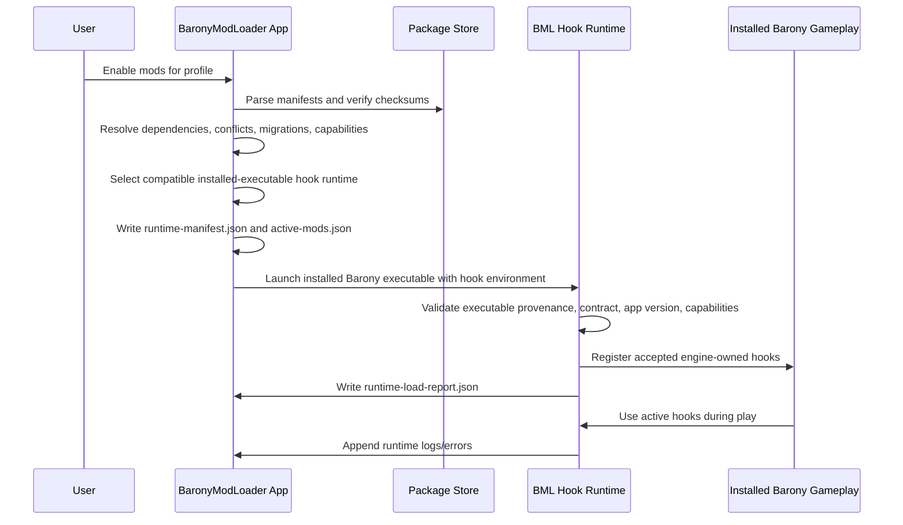

# BaronyModLoader App-to-Engine Runtime Contract Draft

BaronyModLoader is a standalone app paired with a small Barony engine runtime/framework patch. The app owns package installation, profile activation, dependency resolution, validation, launch, and logs. The engine runtime owns safe gameplay hooks and authoritative game-state behavior.

This contract keeps those responsibilities separate so mods remain clean packages instead of hidden executable forks.

## Contract principles

- The app never edits gameplay state directly while Barony is running.
- The engine runtime never scans arbitrary package folders for behavior.
- Packages declare requested capabilities; the app resolves them; the engine confirms or rejects them.
- Runtime manifests are generated per profile/launch and treated as read-only input by the engine.
- Engine-owned hooks are narrow, data-driven, and capability-gated.
- Failures are reported before gameplay when possible and are explicit when discovered at runtime.

## Actors

### Standalone app

The app is responsible for:

- discovering Barony installs and available engine runtime builds;
- importing `.bmlpkg` archives or unpacked development packages;
- verifying manifests, checksums, signatures, dependencies, conflicts, and migrations;
- managing user profiles and mod activation sets;
- selecting the correct Barony executable/runtime for a profile;
- writing launch-time runtime manifests;
- launching Barony with the correct environment/arguments;
- collecting app logs and engine runtime reports.

### Engine runtime

The engine runtime is the paired Barony patch/framework layer. It is responsible for:

- reading the app-written runtime manifest at startup;
- validating the manifest against compiled-in supported contract/capability versions;
- activating safe gameplay hooks for accepted mods;
- owning persistence, named inventories, placement, and multiplayer metadata;
- writing runtime load reports, warnings, and errors;
- refusing unsafe or unsupported state before it can corrupt saves.

### Packages

Packages are immutable input artifacts. They contain manifests, content/assets, native provenance, migration descriptors, and checksums. They do not execute directly.

## Launch flow



## App activation process

Activation is profile-scoped. Enabling a mod for one profile must not mutate another profile or the package archive.

1. Import or locate package.
2. Parse `bml-package.json`.
3. Verify `formatVersion` compatibility.
4. Verify package checksums and optional signatures.
5. Resolve dependencies, conflicts, load order, and exclusive capability ownership.
6. Evaluate native requirements against available Barony runtime builds.
7. Determine required migrations for package/profile/save metadata.
8. Apply app-owned pre-activation migrations.
9. Write `active-mods.json` for the profile.
10. Mark the profile as needing launch-manifest regeneration.

Activation must fail closed. If a package requests an unknown required capability, owns a conflicting exclusive binding, or requires an unverified native runtime, the app disables activation and records a clear validation error.

## Runtime manifest

Before launch, the app writes one complete runtime manifest for the selected profile and Barony executable.

Suggested path:

```text
<profile>/BaronyModLoader/runtime-manifest.json
```

The app passes this path to Barony through a launch argument and may also set an environment variable for discovery:

```text
barony --bml-runtime-manifest <profile>/BaronyModLoader/runtime-manifest.json
BML_RUNTIME_MANIFEST=<same path>
```

The command-line argument wins if both are present.

### Runtime manifest shape

```json
{
  "contract": {
    "id": "bml-runtime-contract",
    "version": "0.1.0"
  },
  "app": {
    "id": "BaronyModLoader",
    "version": "0.1.0"
  },
  "launch": {
    "profileId": "default",
    "gameInstallId": "steam-linux-default",
    "baronyExecutable": "/path/to/barony",
    "createdAt": "2026-07-02T00:00:00Z"
  },
  "mods": [
    {
      "id": "jml.stash",
      "version": "0.1.0",
      "packagePath": "/path/to/Stash-0.1.0.bmlpkg",
      "checksumSet": "sha256:...",
      "loadOrder": 10,
      "capabilities": [
        { "id": "persistent_storage", "version": "0.1.0", "required": true }
      ],
      "modules": {}
    }
  ]
}
```

The runtime manifest should include only resolved, validated package data. It should not include unchecked archive paths, untrusted comments, disabled mods, or package fields the engine runtime does not need.

## Runtime manifest invariants

- `contract.version` must be understood by the engine runtime.
- `mods` must be in resolved load order.
- Every listed mod must have passed app validation.
- Every required capability must include a version range or exact version.
- Exclusive bindings must already be conflict-free.
- File paths must be absolute, normalized, and owned by the app/profile/package store.
- The manifest is read-only during the run.
- Runtime state is written to engine/app state paths, never back into the package archive.

## Capability negotiation

The app and engine runtime both participate in capability negotiation.

### App-side negotiation

The app compares package requests to metadata from registered BML hook runtimes:

```json
{
  "runtimeId": "barony-bml-hook",
  "runtimeStrategy": "installed-binary-hook",
  "runtimeVersion": "0.1.0",
  "storefront": "steam",
  "platform": "linux-x86_64",
  "gameVersionString": "v5.0.2",
  "contractVersions": ["0.1.0"],
  "steamExecutable": "/home/jerry/.local/share/Steam/steamapps/common/Barony/barony.x86_64",
  "steamExecutableBuildId": "58089d84bce3afb48d5b19df032f7aa89d81b69a",
  "hookLibrary": "/path/to/libbarony_bml.so",
  "hookManifest": "native/barony-modloader-hook/manifests/steam-371970-22630456-linux.json",
  "capabilities": [
    { "id": "persistent_storage", "version": "0.1.0" },
    { "id": "persistent_inventory", "version": "0.1.0" },
    { "id": "void_chest_binding", "version": "0.1.0" },
    { "id": "placement_lobby", "version": "0.1.0" },
    { "id": "placement_shop", "version": "0.1.0" },
    { "id": "multiplayer_version_metadata", "version": "0.1.0" }
  ]
}
```

Runtime metadata should come from BML-owned hook/runtime release metadata and be revalidated against the installed executable before launch.

### Engine-side negotiation

At startup, the engine runtime validates the manifest against compiled-in support. It must reject the run if:

- the contract id/version is unknown;
- the app version is explicitly unsupported;
- a required capability is unknown or unsupported;
- a module references an inventory, hook, or binding that was not declared;
- a module uses a capability version outside the runtime's supported range;
- the manifest asks for an unsafe state transition, such as downgrading persistent storage without migration.

Optional capabilities may be disabled only if the manifest describes a safe fallback. For Stash, all requested capabilities are required; disabling one means Stash should not load.

## Engine runtime reports

The engine writes a load report after manifest validation and hook registration.

Suggested path:

```text
<profile>/BaronyModLoader/runtime-load-report.json
```

The report follows the P2 `runtime-load-report` schema used by the app diagnostics fixtures:

```json
{
  "contract": { "id": "bml-runtime-contract", "version": "0.1.0" },
  "runtime": {
    "runtimeVersion": "0.1.0",
    "gameRevision": "git-sha-or-release-id",
    "executable": "/path/to/barony"
  },
  "profileId": "default",
  "status": "loaded",
  "loadedMods": [
    {
      "id": "jml.stash",
      "version": "0.1.0",
      "status": "loaded",
      "capabilities": [
        "persistent_storage",
        "persistent_inventory",
        "void_chest_binding",
        "placement_lobby",
        "placement_shop",
        "multiplayer_version_metadata"
      ],
      "modules": [
        "persistentStorage",
        "persistentInventories",
        "voidChestBindings",
        "placements",
        "multiplayer"
      ]
    }
  ],
  "warnings": [],
  "errors": []
}
```

Top-level `status` is either `loaded` or `failed`. Each `loadedMods` entry carries its own `status`: `loaded`, `failed`, or `skipped`. Capability values in load reports are string ids only, and for the Stash v0 surface they must be exactly the canonical ids: `persistent_storage`, `persistent_inventory`, `void_chest_binding`, `placement_lobby`, `placement_shop`, and `multiplayer_version_metadata`.

If validation fails, `status` is `failed`. For the first Stash-focused handshake artifacts, partial load should be avoided: any Stash required capability failure should abort modded launch and write `loadedMods: []` plus a stable fatal error. Example failed report:

```json
{
  "contract": { "id": "bml-runtime-contract", "version": "0.1.0" },
  "runtime": {
    "runtimeVersion": "0.1.0",
    "gameRevision": "git-sha-or-release-id",
    "executable": "/path/to/barony"
  },
  "profileId": "default",
  "status": "failed",
  "loadedMods": [],
  "warnings": [],
  "errors": [
    {
      "code": "BML_RUNTIME_CAPABILITY_MISSING",
      "severity": "fatal",
      "mod": "jml.stash",
      "capability": "void_chest_binding",
      "message": "Stash requires Void Chest binding, but this Barony runtime does not provide it.",
      "details": {
        "requested": "0.1.0",
        "runtimeVersion": "0.1.0-dev",
        "availableCapabilities": ["persistent_storage"]
      },
      "action": "block-launch"
    }
  ]
}
```

## Error contract

All app and runtime errors should include:

- stable `code`;
- `severity` (`info`, `warning`, `error`, `fatal`);
- package id/version when applicable;
- capability/module id when applicable;
- human-readable `message`;
- machine-readable `details`;
- whether the app can repair, reinstall, disable, migrate, or must block launch.

Example runtime error:

```json
{
  "code": "BML_RUNTIME_CAPABILITY_MISSING",
  "severity": "fatal",
  "mod": "jml.stash",
  "capability": "void_chest_binding",
  "message": "Stash requires Void Chest binding, but this Barony runtime does not provide it.",
  "details": {
    "requested": "0.1.0",
    "runtimeVersion": "0.1.0-dev",
    "availableCapabilities": ["persistent_storage"]
  },
  "action": "block-launch"
}
```

Recommended codes:

- `BML_RUNTIME_MANIFEST_MISSING`
- `BML_RUNTIME_MANIFEST_PARSE_FAILED`
- `BML_RUNTIME_CONTRACT_UNSUPPORTED`
- `BML_RUNTIME_CAPABILITY_MISSING`
- `BML_RUNTIME_MODULE_INVALID`
- `BML_RUNTIME_STORAGE_UNAVAILABLE`
- `BML_RUNTIME_MIGRATION_FAILED`
- `BML_RUNTIME_MULTIPLAYER_INCOMPATIBLE`
- `BML_RUNTIME_PLACEMENT_FAILED`
- `BML_RUNTIME_BINDING_CONFLICT`

## App-written files

The app owns these profile-local files:

```text
<profile>/BaronyModLoader/active-mods.json
<profile>/BaronyModLoader/runtime-manifest.json
<profile>/BaronyModLoader/validation-report.json
<profile>/BaronyModLoader/logs/app.log
```

The app may delete and regenerate these files when the activation set changes.

## Engine-written files

The engine runtime owns these profile-local files:

```text
<profile>/BaronyModLoader/runtime-load-report.json
<profile>/BaronyModLoader/logs/runtime.log
<profile>/BaronyModLoader/state/<mod-id>/...
```

The app may read them for UI and troubleshooting. It should not rewrite runtime state except through explicit migration/repair flows while Barony is not running.

## Persistent storage contract

For Stash-needed modules, persistent storage is the first stateful runtime capability.

Capability id: `persistent_storage`.

The app declares the storage namespace in the runtime manifest. The engine runtime resolves it to a platform-safe path under the selected profile. Packages may provide a human-readable `fileHint`, but the engine chooses the real path.

Rules:

- Storage namespaces are per package id unless a package explicitly depends on a shared namespace owner.
- The engine runtime performs reads/writes at safe game boundaries.
- State files carry schema version and package version metadata.
- The runtime records completed migrations.
- Failed writes are fatal for mods that require persistence.
- Package archives are never modified to store user state.

## Persistent inventory contract

A persistent inventory module defines a named engine-owned inventory.

Capability id: `persistent_inventory`.

For Stash, the initial inventory is `void_chest_inventory`.

Required behavior:

- Load the named inventory from profile/save scoped storage before any Void Chest access can open.
- Preserve Barony item state needed to reconstruct real items: type, count, status, beatitude, appearance, identification, ownership, and relevant metadata.
- Save after safe mutation boundaries such as inventory close and normal save/update points.
- Treat the host as authoritative in multiplayer.
- Fail closed if the inventory cannot be loaded, migrated, or saved.

## Void Chest binding contract

The engine runtime maps selected Void Chest access paths to a named persistent inventory.

Capability id: `void_chest_binding`.

For Stash:

- normal existing Void Chest interactions use `void_chest_inventory`;
- spell-created Void Chests use the same inventory;
- framework-placed lobby/shop access points use the same inventory;
- all access paths must share the same storage-backed inventory instance for the current profile/session.

The package should not fork the Void Chest implementation. It requests binding by data; engine code owns the binding.

## Placement hook contract

Placement hooks are deterministic, engine-owned placement requests. The package declares desired access points; the runtime resolves safe tiles/entities.

Capability ids: `placement_lobby` and `placement_shop`.

For Stash:

- `lobby_assist_area`: place one permanent Void Chest access point near the lobby assist shrine area.
- `generated_shop`: place one permanent Void Chest access point in every generated shop.

Placement failure policy should be explicit:

- If a hook is unavailable, Stash fails to load because permanent access is part of the mod contract.
- If an individual location has no safe tile, the runtime logs `BML_RUNTIME_PLACEMENT_FAILED` with coordinates/context and continues only if gameplay remains safe.
- Placement should be deterministic for multiplayer and replay/save compatibility.

## Multiplayer/version metadata contract

The app writes package/runtime metadata for the selected profile. The engine runtime exposes compatibility state to multiplayer session checks.

Capability id: `multiplayer_version_metadata`.

For Stash:

- host owns persistent stash state;
- clients must have compatible package id/version and runtime capability metadata;
- incompatible clients should be rejected before they can interact with stash state;
- save metadata should record active package id/version, runtime contract version, and persistent inventory schema version.

Minimum metadata fields:

```json
{
  "mods": [
    {
      "id": "jml.stash",
      "version": "0.1.0",
      "runtimeContract": "0.1.0",
      "stateSchemas": {
        "void_chest_inventory": "0.1.0"
      }
    }
  ]
}
```

## Launch modes

The app should support at least these launch modes:

- `vanilla`: launch discovered Barony without a runtime manifest or hook environment.
- `modded-profile`: launch the installed Barony executable with a selected BML hook runtime and generated runtime manifest.
- `validate-only`: generate reports without launching gameplay.
- `runtime-info`: read BML hook/runtime release metadata and verify it against the installed executable.

The `vanilla` path is important: BaronyModLoader should be a clean manager, not a one-way fork installer.

## Clean packaging stance

The contract exists to avoid opaque forks:

- Packages are immutable and checksummed.
- Hook/runtime artifacts are declared with executable provenance, hook checksums, and symbol maps.
- The app selects and launches known installed game executables with BML hook environment instead of replacing the user's game.
- The hook runtime accepts a narrow manifest and reports what it actually loaded.
- State lives in profile/mod storage, not in modified package files.

A user should be able to disable Stash, launch vanilla Barony, inspect package metadata, or remove BML hook/runtime configuration without guessing which manual edits were applied.
